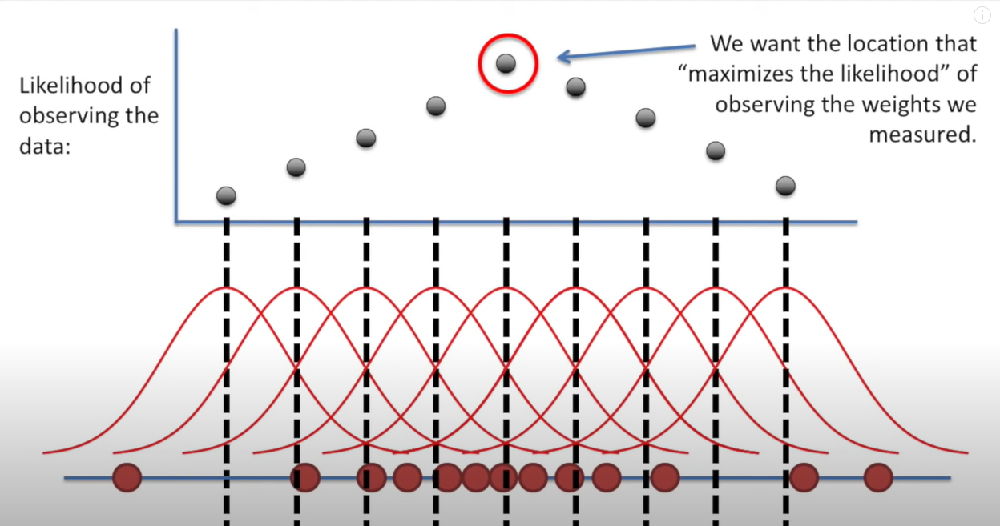
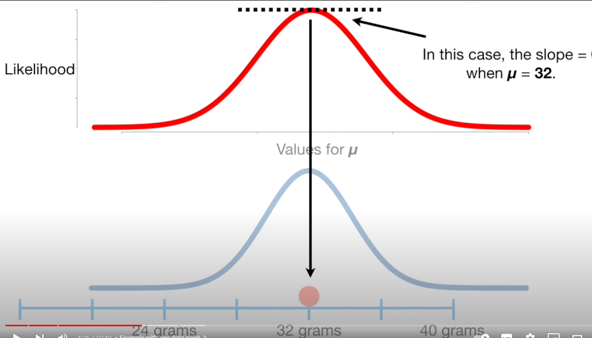
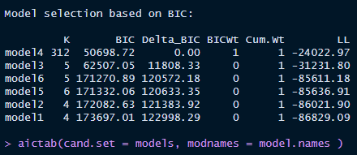

# AIC & BIC 的学习及其R语言实现

## 一，背景知识

### 1，似然和概率的区别

以一个正态分布为例子：

当我们在讨论**概率**的时候，其实就是在讨论
$$
P(X=x|θ)
$$
在固定的分布中的某个区域的占比。也就是公式里的x
$$
L(θ|x)
$$
而**似然**是在固定的值里面讨论分布。也就是公式里的θ

也就是说，概率关注的是在既定模型中的新值，而似然关注的是在固定值里的新模型？

### 2，最大化似然

最大似然的目的是寻找最能够拟合数据的分布，



如上图所示，在画出了各个分布的的似然值之后我们得到了似然函数的最大值，也就是最大似然估计值。

但这并不意味我们已经完全找了的最拟合数据的分布，还需要求其标准差：


### [3，正态分布中的最大似然](https://www.youtube.com/watch?v=Dn6b9fCIUpM)

#### 正态分布：

当取平均值的时候曲线拥有最大值。

曲线的宽度被定义为标准差，越小越瘦。


均值＋/- 2SD的区间占到了整个曲线95%的区域


i.e：

一个标准的正态分布函数：


公式中的 μ 决定了分布的均值所在，越小整个曲线向左偏，反之向右

σ则是SD（标准差），越大曲线越胖，越小越瘦

#### 正餐：

对于正态分布的似然函数，我们的目的是在给定一些值（x）的时候，找到最能拟合这些数据的参数（μ & σ）


举一个最简单的例子：有一个32g的老鼠，我们将参数设置为均值28，标准差为2，代入似然函数计算


可以明显看到，并没有拟合到最大的似然值。因此可以进一步地调整均值μ以达到更加的拟合，


如上所示，当我们**假定标准差固定为2**的时候，我们就可以依次用不同的均值去拟合数据，每次拟合的结果便是似然函数上的一个点，最终我们得到以下似然函数，在其斜率为0时可以获得其最大值。



在得到理想的均值拟合之后，我们便需要将**均值μ与x固定**以寻找最拟合的标准差σ，与上同理，


如果我们有更多的数据，我们就可以用不同的σ计算似然值，并将其绘制成为曲线，在其斜率为0处得到其最大值。


**总而言之**：当我们估计μ的最大似然估计值的时候，我们将σ视为一个常数，以找到似然函数在何处斜率为0（最大值），反之当我们估计σ的最大似然估计值的时候，我们将μ视为常数，做同样的事情。


以上是一个理解概念的简单例子，那么有意思的东西来了，如果有更多的数据呢？


我们在拟合的时候取的值就是这两个数据的似然值的乘积。

如果我们有有n个呢？很简单，跟上面也是一样的！就是求所有个体似然的乘积。


那接着问题就变成了我们如何求这个函数的最大值了吧？

但凡正常高考都知道导数为0时可以求函数最大值吧。。。

我们在上面分步求解了μ和σ的最大似然，这里同样可以将它们各自视为常数，然后通过求导，令其导数为0便可以得到最大值了。

但这样比较繁杂，来看一种新方法吧：**对数似然函数**


这样可以使得求导变成十分方便。


对于似然函数而言，它们的对数似然函数的最大值是与其最大值是相等的。

将这个对数似然函数化简得到以下函数：**（有空我自己推！！！）**


对其求导得到（有空自己推，用到了链式法则）：

①μ的对数似然函数求导：


②σ的对数似然函数求导：


好了现在我们有了它们的两个导数，令其均等于0，便可求其最大值。


μ的对数似然函数为0时，μ的值居然就是测量值的均值，真神奇！

同样，求出σ的值，居然就是测量值的标准差，真神奇！


以上就是正态分布的最大似然估计


## 二, [Akaike Information Criterion (AIC)](https://www.scribbr.com/statistics/akaike-information-criterion/)

### 1.简介

​	**AIC**是一种用数学方法，用以估计模型与生成它的数据的拟合程度。

​	在统计学上，AIC用于比较不同可能的模型，并决定哪个模型最能够拟合数据。

AIC由以下两个步骤计算而来：

​							1.用以构建模型的**独立向量**数量

​							2.模型的最大似然估计（模型再现数据的程度）

根据AIC的最佳拟合模型，是使用尽可能少的独立变量来解释最大的方差组份

> 下面我们来举一个应用AIC的例子，比如你想知道是否喜欢猫受到年龄的影响。你就必须去做一个猫咪喜爱调查，你需要收集一些被调查人的信息，比如性别，经济情况评分，所在地区等等信息。
>
> 然后你想查明哪个变量对预测喜爱猫咪的比较重要，你创建了几个可能的模型，比如：y（爱猫咪的程度）=性别+经济情况评分+臭脚之类（你喜欢就好）
>
> 然后你用AIC来比较这些模型，就可以得到最拟合的模型了。


### 2.使用情况

​	在统计上， AIC最常用于模型选择。通过计算和比较几个模型的AIC评分，你就能选出最能拟合数据的模型。

​	检验假设时， 你可能会收集不确定的变量数据，特别是在探索新想法时。（比如之前的臭脚），而你想知道的是，你测量的哪些自变量解释了因变量的变化。

​	一个比较好寻找方法是，创建一个模型集，每个模型都包含了你测量不同的独立变量的组合（当然可以包括臭脚）。但一般来说这些组合应该根据以下规定：

​			1.**你的系统性知识**——避免使用没有逻辑使用的参数。（~~但我感觉臭脚人不喜欢猫是有逻辑的~~）*因为你几乎可以发现任何东西之间的虚假相关*。

​			2.**你的实验设计**——例如。如果您在测试对象中分配了两种处理方法，那么可能没有理由测试两种处理方法之间的相互作用。

一旦你创建了几个可能的模型，你就能用AIC来比较它们。**更低的AIC评分的模型更好**，AIC会倾向于选择使用参数更少的模型。所以，如果两个模型解释了一样的方差组分，用更少参数的模型将会有更低的AIC评分。

> 模型选择例子
>
> ​	如果你想研究花费的时间和考试形式（全部为选择题或全为问答题）对考试成绩的影响，你创建了两个模型：
>
> ​			1. 最终测试成绩由学习时间决定
>
> ​			2.最终测试成绩由学习时机+考试形式
>
> 你发现模型 1 的 r^2 为 0.45，p 值小于 0.05，模型 2 的 r^2 为 0.46，p 值小于 0.05。模型 2 对数据的拟合稍好一些——但是添加另一个参数是否值得 获得模型拟合的小幅增加？
>
> 然后你进行一个AIC测试，发现模型1获得更低的AIC分数，因为它要求使用更少的信息去预测出了几乎一样的准确度。或者你可以认为模型2的精确度提升是可能是偶然导致的。
>
> 通过AIC测试，你决定使用模型1作为你的研究的最适模型

### 3， 如何使用AIC比较模型

AIC使用最大似然估计和模型中参数(自变量)的数量来确定模型的相对信息值。AIC的公式为
$$
AIC =2K-2ln(L)
$$
K是自变量的数量，L是对数似然估计（也就是模型可能产生的y观测值的可能性。K的默认初始值为2，如果模型使用了一个自变量，那么K的取值为3，用了两个K就是4，以此类推。

如果你有你的模型的对数似然估计，你可以轻易地算出AIC的值，但是计算对数似然函数很复杂。大多数统计软件都有用以计算AIC的函数。R狗当然用R。

### 4，R实现AIC

用R来实现AIC有许多方法，可以使用R自带的函数AIC（），也可以实现AICcmodavg 包里的aictab（）函数，下面用这两种方法来举例。

> 补充一点背景知识：在回归模型中，交互项用于检测两个或多个自变量之间的相互作用。如果模型中包含交互项，那么一个自变量对因变量的影响可能会取决于另一个自变量的值。而下面的interaction.mod便是使用了交互项

```R
bmi.data <- read.table("bmi.data.csv", header = T, sep = ",")
age.mod <- lm(bmi ~ age, data = bmi.data)
sex.mod <- lm(bmi ~ sex, data = bmi.data)
consumption.mod <- lm(bmi ~ consumption, data = bmi.data)

age.sex.mod <- lm(bmi ~ age + sex, data = bmi.data)
sex.consumption <- lm(bmi ~ sex + consumption, data = bmi.data)
combination.mod <- lm(bmi ~ age + sex + consumption, data = bmi.data)

interaction.mod <- lm(bmi ~ age*sex*consumption, data = bmi.data)
#这里的K为9,这是因为三个主效应项（‘age’，‘sex’和’consumption’），三个二阶交互项（‘age:sex’，‘age:consumption’和’sex:consumption’）以及一个三阶交互项（‘age:sex:consumption’）。因此，这个模型的’K’值为3+3+1+2##

install.packages("AICcmodavg")
library(AICcmodavg)

  models <- list(age.mod, sex.mod, consumption.mod, age.sex.mod, sex.consumption, interaction.mod, combination.mod)
  model.names <- c('age.mod', 'sex.mod', 'consumption.mod','age.sex.mod', 'sex.consumption','interaction.mod','combination')
  
  aictab(cand.set = models, modnames = model.names)
  
  AIC(age.mod, sex.mod, consumption.mod, age.sex.mod, sex.consumption, interaction.mod, combination.mod)
```


* **K** ： 模型的参数数量。默认K的值为2，还有一种情况。当分类变量拥有超过2的水平时，多出来的水平数也会算入K中，比如上面的model4，K=2+3+307(pen参数的多余水平)

* **AICc** ： 模型的信息分数（小写字母“c”表示该值是根据针对小样本量校正的 AIC 测试计算得出的）。 AIC 值越小，模型拟合越好。

* **Delta_AICc** : 最佳模型与被比较模型之间的 AIC 分数差异。在此表中，次佳模型与顶级模型相比的 delta-AIC 为 6.33，而第三佳模型与顶级模型相比的 delta-AIC 为 17.57

* **AICcWt** ： AICc 权重，即被评估模型中包含的全套模型所提供的预测能力总量的比例。 在这种情况下，顶级模型包含可在全套模型中找到的总解释的 96%。

*  **Cum.Wt** : AICc 权重的总和。这里前两个模型包含 100% 的累积 AICc 权重。

* **LL** ： 对数似然。这是描述模型在给定数据的情况下的可能性的值。 AIC 分数是根据 LL 和 K 计算的

从这个表中我们可以看出，最好的模型是组合模型——包括每个参数但没有交互作用的模型（bmi ~ 年龄 + 性别 + 消费）。

该模型比其他所有模型都要好得多，因为它承载了 96% 的累积模型权重并且具有最低的 AIC 分数。 次优模型比最佳模型（6.33 个单位）高出 2 个以上的 AIC 单位，并且仅占累积模型权重的 4%。

基于这种比较，我们将选择组合模型用于我们的数据分析。

下面来试试R自带的AIC（）函数！


很遗憾，只有df（和K值等同）与AIC分数，很不好用是吧。


## 三，Bayesian Information Criterions（BIC）

#### 1.简介

和AIC一样，BIC是也是用来比较模型之间的优劣的。其计算公式为：
$$
BIC=log(n)*k-2*L
$$

* L是似然函数

*  n是样本大小

* K是参数数量

#### 2.BIC和AIC的比较

##### 	共性：

构造这些统计量所遵循的统计思想是一致的，就是在考虑拟合残差的同事，依自变量个数施加“惩罚”。

##### 	不同点：

- BIC的惩罚项比AIC大，考虑了样本个数，样本数量多，可以防止模型精度过高造成的模型复杂度过高。
- AIC和BIC前半部分是一样的，BIC考虑了样本数量，样本数量过多时，可有效防止模型精度过高造成的模型复杂度过高。
- AIC和BIC的原理是不同的，AIC是从预测角度，选择一个好的模型用来预测，BIC是从拟合角度，选择一个对现有数据拟合最好的模型，从贝叶斯因子的解释来讲，就是边际似然最大的那个模型


### 3.BIC的R实现

同样的AICcmodavg包里面，也有求BIC的函数 bictab（）。下面用自己的数据来试试:

```R
library(tidyverse)
phe <- read.csv("pheno_raw.csv", sep = ",", header = T, na.strings = "") %>%
  filter(品种品系=="美系大白") %>%
  subset(str_detect(id,"YY"))  %>%
  subset(select = c("sex", "weight", "times", "bro", "inbreeding", "loc", "pen", "AGE", "DG", "BF")) %>%
  filter(!str_detect(sex,"阉")) 

str(phe)  #查看原始数据的数据类型，因为如果y不是数值型变量的话，lm()会报错的##
phe$pen <- as.character(phe$pen)  #编辑各个数据类型##

model1 <- lm(DG ~ sex + weight , data = phe)
model2 <- lm(DG ~ sex + times , data = phe)
model3 <- lm(DG ~ sex + weight + inbreeding, data = phe)
model4 <- lm(DG ~ sex + weight + pen, data = phe)
model5 <- lm(DG ~ sex + weight + loc, data = phe)
model6 <- lm(DG ~ sex + weight + bro, data = phe)
##注意，如果模型中包含分类变量比如loc，且其水平大于两个水平就会再K上加上这个多出来的水平
   #比如对于model5，K=2(初始值）+3（模型参数）+1（因为loc有三个水平，所以3-2=1） ##

library(AICcmodavg)

models <- list(model1, model2, model3, model4, model5, model6)
model.names <- c('model1', 'model2', 'model3', 'model4', 'model5', 'model6')

bictab(cand.set = models, modnames = model.names )

```



哈哈，这model4的k值上天了是吧！但是如果他用了那么多参数，那不是被惩罚烂了。但是它还是排第一，这是因为Pen这个向量是一个分类向量，而且水平高得离谱（312-2-3）。所以它们全跑K这里来了。

剩下的别的值，跟AIC差不多啦。


## 四，总结

​		学会了AIC和BIC你可能会问，我们学到的只是如何比较模型。可是我们怎么知道我们构建出来的模型都是一帮low逼模型，我们只不过是在矮子里面拔高个呢？答案是——哈哈，我们还真不知道。

```R
##全子集回归，后续补充
install.packages("leaps")
library(leaps) 
leaps <- regsubsets(CF_RR ~ (1|location) + (1|batch) + sex + (1|dam), data = pre_fctors, nbset = 6)
```

> **随机效应的表示解释：**
>
> 1. **(1|dam):**
>    - `(1|dam)` 表示在因子变量 `dam` 的水平上存在一个随机效应。
>    - `(1|dam)` 中的 `1` 表示截距项，即模型中的常数。
>    - 该结构假设每个水平（每个不同的 `dam`）都有一个独立的随机效应，这个随机效应对应于截距项。
> 2. **(random_effect1 | grouping_variable):**
>    - `(random_effect1 | grouping_variable)` 表示在因子变量 `grouping_variable` 的水平上存在一个随机效应，而且这个随机效应被命名为 `random_effect1`。
>    - 这种形式允许指定多个随机效应，并为每个效应分配一个名称。
>    - 这个结构假设在每个 `grouping_variable` 水平上存在一个独立的随机效应，这个效应被称为 `random_effect1`。

​		所以，**构建模型的时候要充分考虑你的专业知识和逻辑，构建出所有你能想到的模型，再用AIC和BIC比较它们，挑选出最优的那一个。**

至于是不是矮子里面拔高个嘛...尽人事听天命吧~

#### 与HIBLUP的结合使用

之所以用AIC 和 BIC进行模型比较，是想用最佳的模型去拟合数据。之后这个模型是需要计算的，之后用HBLUP进行分析的时候。为了提高模型的遗传评估准确性，要确定模型的 **固定效应，随机效应，协变量** 等。那么如何考虑一个因素作为哪类模型加入到模型中呢？通常按照以下方式：

* 协变量： 当该效应的水平呈现 **数值型的连续性变化，无明显分组时** ，考虑作为协变量。
* 固定效应: 当该效应的水平呈现 **多个分组，且记录的水平数能够覆盖总体所有可能性** ，考虑作为固定效应。
* 随机效应： 当该效应的水平数呈现 **多个分组，且记录的水平数不能替代总体** 可考虑作为随机效应。


**但是对于生长性状，一些繁殖性状相关的东西就不要加**


**但在模型的选择中并不是完全依赖AIC或者BIC的结果，我们的目的不是要让遗传力特别高，或者残差特别低，我们的目的是构建符合这个性状的最优模型。因此平时多看文献，看看文章将什么数据作为因变量的参数，多总结经验**


## 模型选择

1. **方差分析：**对每个参数进行方差分析去除所有不显著的参数

   > 但这样做会出现一种情况，就是比如有A参数和B参数，如果我把A和B一起放入模型中，那么A是不显著的，但是如果我单独放A，A就是显著的，因此要这样做的话我必须循环来做，每次把最不显著的去掉，而不是只要是不显著的都去掉

2.  **AIC/BIC比较** ： 对经过方差分析的参数构建模型，选取 AIC/BIC值最低的模型

   > 其实通过AIC/BIC可以规避上面的情况，并且没有方差分析那么繁琐。而且最终得到的结果应该和方差分析得到的是类似的。
   >
   > TO DO LIST： 对比AIC和方差分析得到的结果（优先级：不高）

3. **调参**：将获得的模型用于方差组分估计，观测遗传力大小是  否与前人研究相似进行调参

   > 至关重要的一步，平时没事多总结别人的模型
