## [主成分分析（PCA）](https://www.bilibili.com/video/BV1E5411E71z/?spm_id_from=333.337.search-card.all.click&vd_source=2390ba6464382a57d24aed101974d68d)

### 是什么？

PCA是一种降维的方法，其本质就是找坐标系

PCA的目标是：只保留一个轴的时候（二维降到一维），信息保留最多。

.e.g:

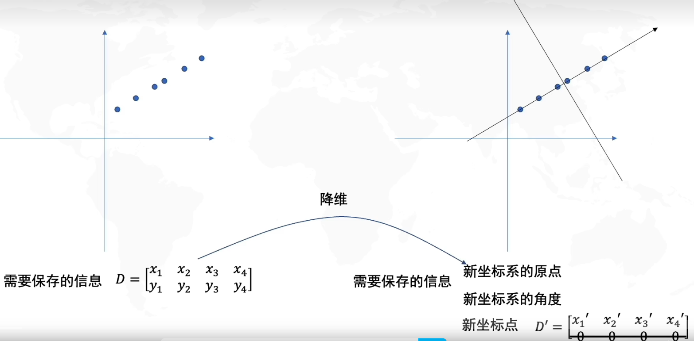


怎么样最好：找到数据分布最分散的方向（**方差最大**），作为主成分1（坐标轴）与之垂直的为主成分2 。也就是说找主成分1上投影分布方差最大时。

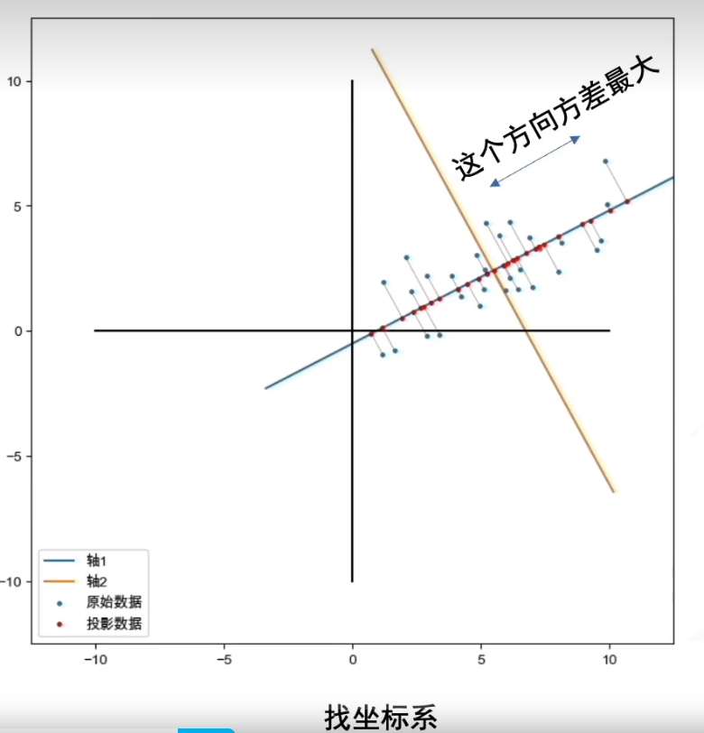

### 怎么做？

首先：去中心化（把坐标原点放在数据中心）

然后：找坐标系（找到方差最大的方向）


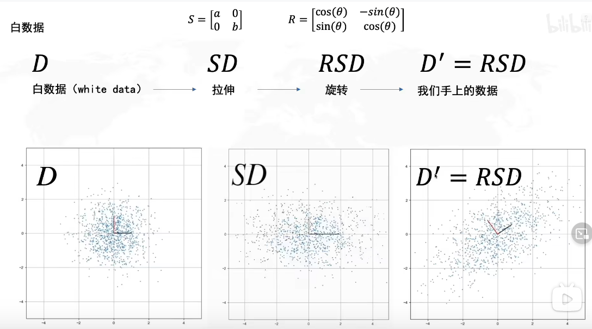

所谓白数据是理想数据，符合标准正态分布。在此引入白数据是为了更好地计算协方差，，同时也可以看作我们的数据D’ 作标准化转化为白数据。

**拉伸**的方向就是方差最大的方向是横或者纵

**旋转**的角度决定了方差最大方向的角度

所以我们要求 **R**


而同样的，我们手上的数据也可以变为白数据.e.g：

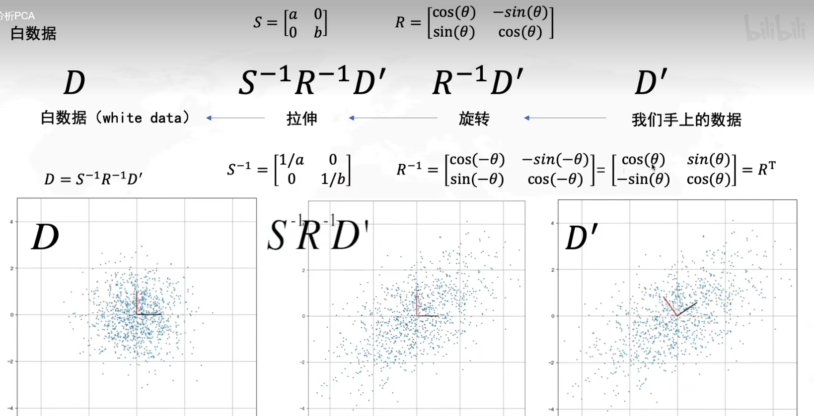


### 如何求R？

*协方差矩阵的特征向量*就是R

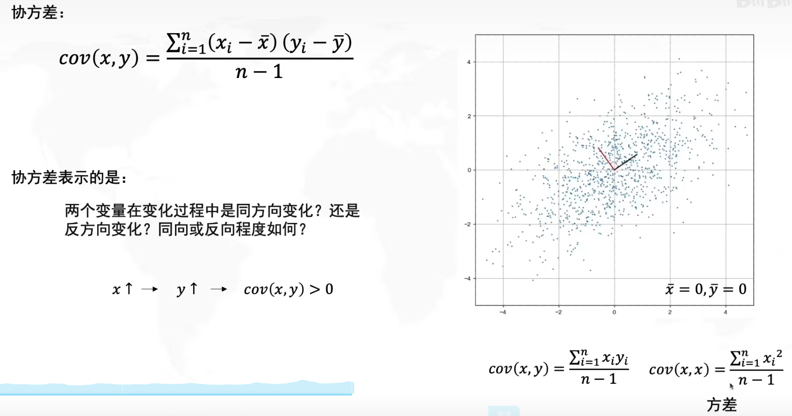																																					因为已经去中心化了所以X,Y的均值均为0

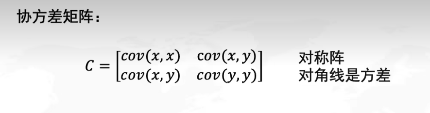

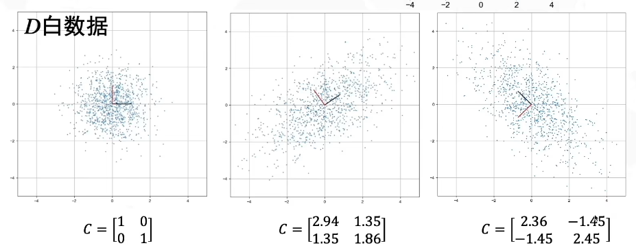

白数据的X，Y不相关所以协方差为0								正相关协方差为正数											负相关协方差为负数


当去中心化后，X,Y的均值为0，则有

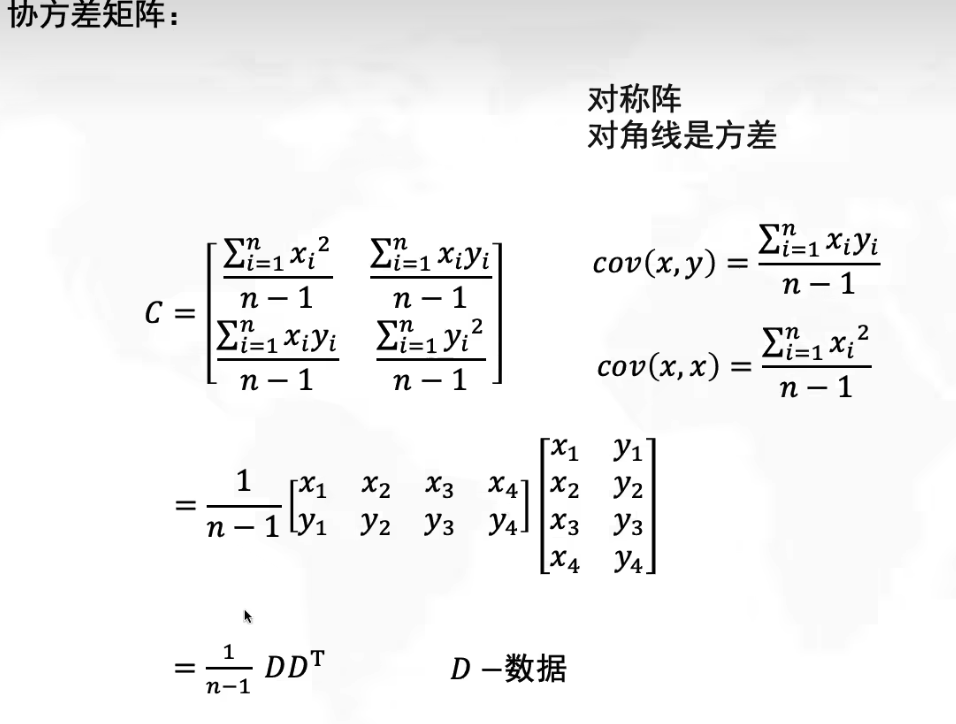

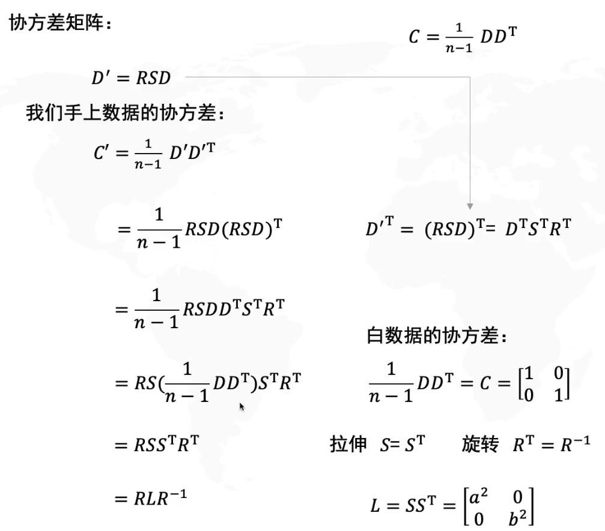

得出协方差以后，可以根据公式：C‘ **v** = λ **v**求出特征值(λ)与特征向量（**v**）

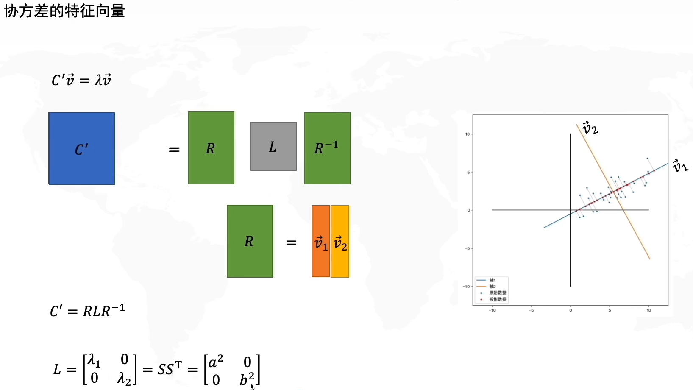

R矩阵就是特征向量**v1**(第一列)与**v2**（第二列）的组合矩阵

而特征值λ1就是x轴上拉伸的倍数a的平方；特征值λ2就是y轴上拉伸倍数b的平方


### PCA的求解路径

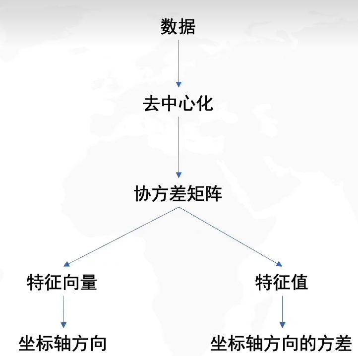

### 使用prcomp（）函数计算pca并用ggplot实现可视化

prcomp函数输入参数为变量矩阵（x）,中心化（center,默认为true），标准化（scale，默认为false，建议改为true），主成份个数（rank）。prcomp函数输出有sdev(各主成份的奇异值及其方差累积)，rotation（载荷矩阵），x（得分矩阵），center(变量的均值),scale（变量的标准偏差）

```R
#用prcomp()函数计算pca并用ggplot画图#

#读取数据#
data <- as.data.frame(mtcars)
#使用prcomp()计算pca，scale. = T表示对前面的数据进行归一化
pca_mtcars <- prcomp(mtcars,scale. = T,center = T)

#观测各主成分的贡献方差比例#
summary(pca_mtcars)
#存储方差贡献比例#
tem <-summary(pca_mtcars)
#提取各个主成分贡献方差比例#
mtcars_percent <- as.data.frame(tem$importance[2,])

#建议一步到位#
#sdev为标准差，其平方为特征值，round()为四舍五入函数，2表示保留两位小数，每个主成分的特征值占比即为其方差贡献度#
mtcars_percent <- round((pca_mtcars$sdev)^2/sum((pca_mtcars$sdev)^2)*100,2)

#画个丑图#
biplot(pca_mtcars,scale = 0)


#提取pc1与pc2#
dataForpca <- as.data.frame(pca_mtcars$x[,1:2])
#将名字加入使其变成数据框方便ggplot画图#
dataForpca$cars <- row.names(dataForpca)
#提取载荷，也就是R阵（协方差矩阵的特征向量）#
rotate <- as.data.frame(pca_mtcars$rotation[,1:2])
#将名字加入使其变成数据框，方便ggplot画图
rotate$index <- row.names(rotate)

#可视化pca结果#

library(tidyverse)
library(ggforce)
#使用ggplot画图#
#读取数据#
ggplot(data =dataForpca)+
  geom_hline(yintercept = 0,linetype="dotted") +
  geom_vline(xintercept = 0,linetype="dotted")+  #这两步是在定义新的坐标系，并画出坐标轴#
  #这一步是画散点图，aes后跟的是x轴与y轴,color表示每个点的颜色，show.legend返回具体每个点的意思#
  geom_point(mapping = aes(x=PC1,y=PC2,color =dataForpca$cars),show.legend = F)+
  
  labs(title = "汽车性能PCA图",
       x =paste0("PC1(",mtcars_percent[1,]*100,"%)"),
         y =paste0("PC2(",mtcars_percent[2,]*100,"%)"))+  #提取每一主成分的方差贡献占比，%）表示以百分数表示
          theme_minimal() #设定主题,把灰白的格子变成白色的格子#
  
  
  
  #或者你可以用文字代替点#
ggplot(data=dataForpca)+ 
    geom_hline(yintercept = 0, colour = "gray88", linetype ="dashed") +
    geom_vline(xintercept = 0,colour = "gray88", linetype="dashed")+
    #geom_text()函数，写字，必须要指定label#
    geom_text(aes(x=PC1,y=PC2, color =dataForpca$cars,label = cars), size = 3, show.legend = F)+
    #主题设置：去掉背景的灰白色格子#
  theme_bw() + theme( panel.grid.major = element_line(colour = NA),panel.grid.minor = element_blank())
  
```

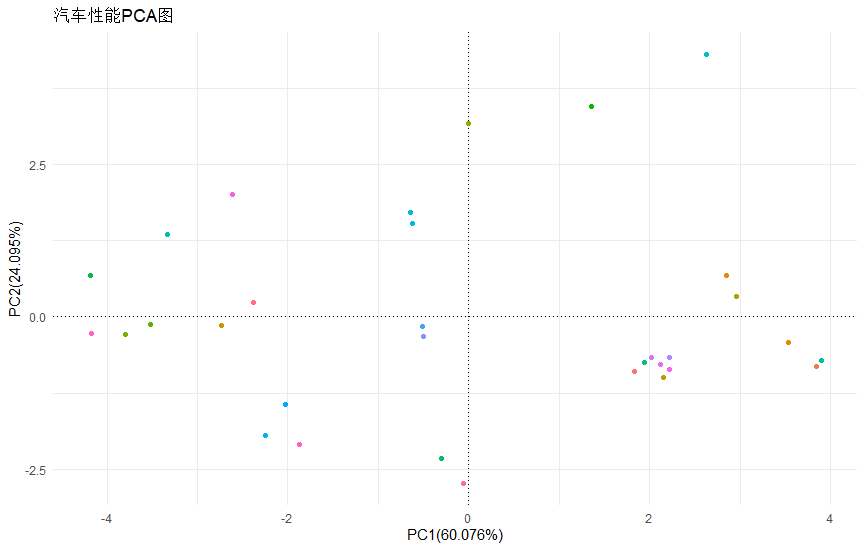


### 使用cmdscale（）函数计算大群体pca，并可视化（此函数只能用于计算方阵，或距离阵）

```R
getwd()
setwd("D:/Rdata")

dist_populations <- read.table("dataForPCA.mdist",header = F)

#提取物种名称,此处的data.frame(xx=read.table("x"))其实是在为提取的数据命名#
fam <- data.frame(famids=read.table("dataForPCA.mdist.id")[,1])

#提取个体名称#
famInD <- data.frame(IID=read.table("dataForPCA.mdist.id")[,2])

#使用cmdscale（）函数实现PCA,5是指考虑前面五个主成分#
mds_populations <- cmdscale(dist_populations,eig = T,5)
summary(mds_populations)

#提取特征向量#
eigenevec_populations <- cbind(fam,famInD,mds_populations$points)

#每个特征向量捕获的变异比例,逗号后面的2是保留两位小数的意思#
eigen_percent <- round((mds_populations$eig)/sum(mds_populations$eig)*100,2)

if(!require("tidyverse")) {
  install.packages("tidyverse",dependencies = T)
  library("tidyverse")
}

#画PCA图
ggplot(data = eigenevec_populations) +
  geom_point(mapping = aes(x =`1`,y = `2`,color = famids),show.legend = F) +
  geom_hline(yintercept = 0,linetype ="dotted") +
  geom_vline(xintercept = 0,linetype = "dotted")+
  labs(title = "世界山羊群体的PCA图",
       x =paste0("主成分1(",eigen_percent[1],"%)"),
       y =paste0("主成分2(",eigen_percent[2],"%)")) +
  theme_minimal()
```

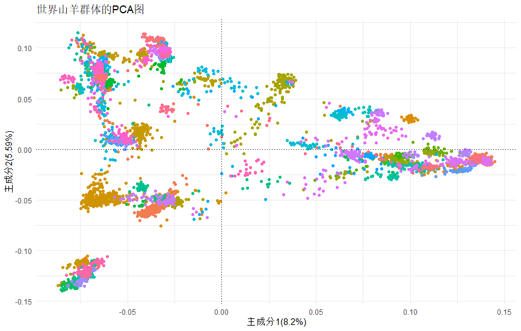