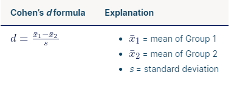
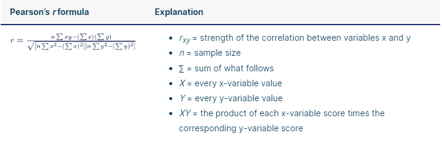
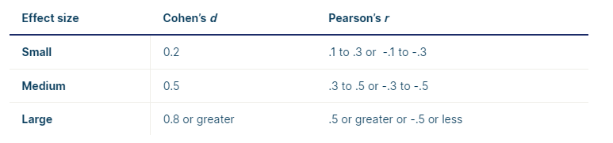

# 科恩d值（Cohen' d）和皮尔森相关系数 (Pearson's)

## 效应量(Effect Size)的概念

效应量能够告诉我们变量之间的关系和组别之间的差异的重要性，它表明了一项研究成果的实际意义。

效应量大表明了研究发现具有实际意义，效应量小则表示实际应用有限。


## 效应量的重要性

虽然统计显著性表明研究中存在某种效应，但实际意义表明该效应大到足以在现实世界中有意义。**统计显著性由 p 值表示，而实际显著性由效应量表示**。

单独的统计显著性可能会产生误导，因为它受到样本量的影响。 增加样本量总是更有可能找到统计上显着的效果，无论效果在现实世界中真正有多小。

相反，效果大小与样本大小无关。只有数据用于计算效果大小。

> 示例：统计显著性与实际显著性
>
> 一项大型研究比较了两种减肥方法，对照组有 13,000 名参与者，实验干预组有 13,000 名参与者。 对照组使用科学支持的减肥方法，而实验组使用基于应用程序的新方法。
>
> 六个月后，实验干预组的平均体重减轻 (kg) (M = 10.6，SD = 6.7) 略高于对照组的平均体重减轻 (M = 10.5，SD = 6.8)。
>
> 这些结果具有统计学意义 (p = .01)。然而，两组之间仅 0.1 公斤的差异可以忽略不计，并不能真正告诉您一种方法应该优于另一种方法。
>
> 添加具有实际意义的措施将表明这种新干预措施相对于现有干预措施的前景如何。

## 效应量的种类

常用的效应量包括Cohen’s d、Pearson’s r、Hedge’s g、Glass’s Δ等。

不同的效应量适用于不同的统计方法。例如，Cohen’s d和Hedge’s g常用于t检验和方差分析；Pearson’s r常用于相关分析和回归分析；Glass’s Δ常用于元分析。

*因为平时用科恩d值和皮尔森相关系数较多，重点说明这两。后续有需要再补充*


## 如何计算效应量？

有几十种效应量的衡量方法。 最常见的效应量 Cohen's d 和 Pearson's r。 Cohen's d 衡量两组之间差异的大小，而 Pearson's r 衡量两个变量之间关系的强度。

### 科恩d值（Cohen's d）

科恩d值是用来比较两组之间的差异的。它采用两组均值之间的差异，并以标准差单位表示。它告诉您两个均值之间有多少个标准差。




在这个公式中选择哪个标准差取决于你的实验设计。

* 基于两组数据的合并标准差

* 对照组的标准差，如果您的设计包括对照组和实验组

* 如果您的重复测量设计包括前测和后测，则为前测数据的标准差

> 示例：计算科恩 d值
>
> 要计算减肥研究的 Cohen‘s d，您需要采用两组的均值和控制干预组的标准差。
> $$
> d = \frac{\overline{x}_1 - \overline{x}_2} {s}
> $$
>
> $$
> d = \frac{(10.6 - 10.5)}{6.8} = 0.015
> $$
>
> Cohen's d 为 0.015，实验干预比对照干预更成功的发现没有实际意义。

### 皮尔森相关系数(Pearson's r)

皮尔森相关系数，或者说相关系数，是用以衡量两个变量间的线性关系程度的。



该公式的主要思想是计算一个变量的可变性有多少是由另一个变量的可变性决定的。

Pearson‘s r 是衡量变量之间相关性的标准化量表——这使得它没有单位。您可以直接比较所有相关性的强度。

需要注意的是，Pearson's r 与 Cohen's d 一样，只能用于区间或比率( [interval](https://www.scribbr.com/statistics/interval-data/) or [ratio](https://www.scribbr.com/statistics/ratio-data/) )变量。其他影响大小的度量必须用于有序或名义( [ordinal](https://www.scribbr.com/statistics/ordinal-data/) or [nominal](https://www.scribbr.com/statistics/nominal-data/) )变量。


## 如何确定效应量表示的差异是大还是小

根据 Cohen 的标准，效应量可以分为小、中或大。

标准如下：



**科恩d值的取值范围为0到无穷大之间，然而皮尔森相关系数的取值范围为-1到1之间**

一般来说，Cohen's d 越大，效应量越大。对于 Pearson’s r，值越接近 0，效应量越小。接近 -1 或 1 的值表示较高的效果大小。

皮尔森相关系数告诉了你一些关于两个样本间关系的方向。

* 正值（例如 0.7）表示两个变量一起增加或减少。

* 负值（例如 -0.7）表示一个变量随着另一个变量的减少而增加（反之亦然）。

小或大效应量的标准也可能取决于您所在特定领域的常见研究，因此在解释效应值时一定要检查其他论文。

##  你需要在何时计算效应量？

甚至在您开始研究之前和完成数据收集之后计算效应量也会很有帮助。

### 研究开始前

了解预期的效应量意味着您可以计算出足够的统计功效（ [statistical power](https://www.scribbr.com/statistics/statistical-power/) ）来检测该大小的效果所需的最小样本量。

在统计学中，功效是指假设检验检测到真实效果（如果存在）的可能性。统计上强大的测试更有可能拒绝假阴性（II 型错误(a [Type II error](https://www.scribbr.com/statistics/type-i-and-type-ii-errors/)).）。

如果您在研究中没有确保足够的功效，即使具有实际意义，您也可能无法检测到具有统计显着性的结果。在那种情况下，即使存在实际效果，您也不会拒绝原假设。

通过执行功效分析，您可以使用一组效应量和显着性水平来确定特定功效水平所需的样本量。

### 研究完成之后

收集数据后，您可以在论文的摘要和结果部分计算和报告实际效应量。

效应量是元分析研究中的原始数据，因为它们是标准化的并且易于比较。元分析可以结合许多相关研究的影响大小，以了解特定发现的平均影响大小。

但元分析研究还可以更进一步，还可以说明为什么效应量可能因单个主题的研究而异。这可以产生新的研究方向。


> 计算出`d`值后，您可以知道两个样本之间的效应量。但是，仅仅知道效应量并不能告诉您两个样本之间的差异是否具有统计学意义。为了确定两个样本之间的差异是否具有统计学意义，您需要进行假设检验。
>
> `pwr.t.test（）`不仅可以用来计算效应量，还可以用来进行功效分析。功效分析是一种统计方法，用于确定实验设计的统计效力。也就是说，它可以帮助您确定在给定的显著性水平下，您的实验有多大的概率检测到两个样本之间的差异。
>
> r实现：
>
> ```r
> d <- mean(temp_pure$校正115公斤体重日龄, na.rm = T) - mean(temp_pure$AGE115kg, na.rm = T) 
> d <- d / sd(c(temp_pure$校正115公斤体重日龄, temp_pure$AGE115kg), na.rm = T)##Cohen’s d定义为两个样本均值之差除以两个样本的标准差。
> AGE115kg_ttest_pwr <- pwr.t.test(n = length(temp_pure$校正115公斤体重日龄), d = d, sig.level = 0.05, type = "two.sample")
> ```
>
> 


