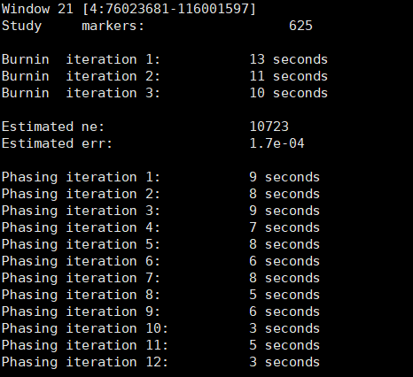
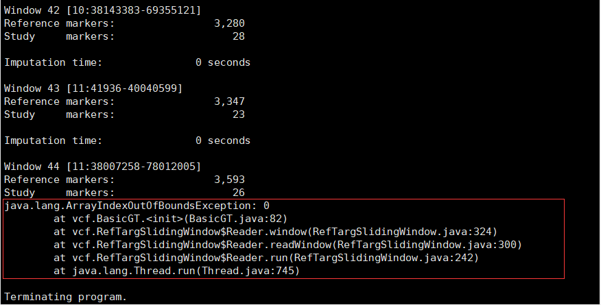
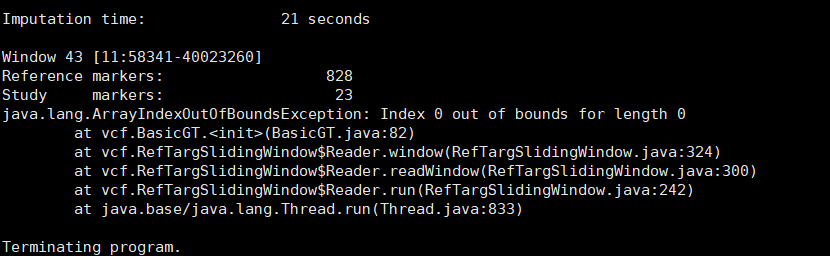
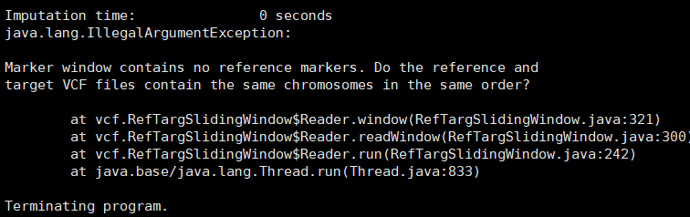

# Beagel 与vcftools的吃瘪与学习

## 功能

### 定相 （Phasing）

所谓Phasing就是要把一个二倍体（甚至是多倍体）基因组上的等位基因（或者杂合位点），按照其亲本正确地定位到父亲或者母亲的染色体上，最终使得所有来自同一个亲本的等位基因都能够排列在同一条染色体里面。

LD Phasing是一个非常常用的基因定相方法，它是利用群体中大量无血缘关系的个体，依据基本的连锁不平衡(Linkage disequilibrium，LD)遗传原理和相关数学模型，推断群体中每个个体的单倍体的方法，因此它也是计算量最大的一个。

#### 定相与未定相的区别

未定相：variant1: 0/1 variant2: 0/1

​				我们不确定变体 1 和 2 是否属于同一个同源染色体。

定相：variant1: 0|1 variant2: 0|1

​				他们在同一条同源染色体上。


### 填充 （Imputation）

根据定相结构，进行填充。

#### 填充的标准与影响因素

填充的准确性标准为R^2

**影响填充准确性的因素有：**

> ​	参考群体的大小
>
> ​	芯片密度
>
> ​	MAF
>
> ​	定相准确性
>
> ​	参考群体的测序深度

## 使用方式

```java
java -Xmx[GB]-jar beagle.jar [arguments]
```

`Xmx[GB]` 表示设置的内存大小

`-jar beagle.jar` 是你下载的beagle，不同版本的前缀不同

`[arguments] `是你设置的参数

## 填充命令

### **填充命令**

`gt=[file]`，比如`gt=a.vcf`，就是被填充文件，**vcf格式的文件**。如果自填充，这个参数就够了。

如果有参考群，用：`ref=[file]`，比如`ref=ref.vcf`，已经被填充好的文件，vcf格式

`out=[string]`，输出名称，比如`out=result`，结果会生成result.vcf，被填充好的文件。

```bash
#例如
java -Xmx[10g]-jar beagel.jar gt=a.vcf out=b

#一个复杂的例子
java -jar beagle.22Jul22.46e.jar gt=YX_58097.vcf.gz window=30 overlap=3  out=YX_rf_all_de_missing  nthreads=20

```

### 常用参数

> 在beagle中，窗口大小（`window`）和重叠程度（`overlap`）是用来控制基因型填充过程中窗口的大小和重叠程度的参数。
>
> beagle使用滑动窗口算法来进行基因型填充。它将基因组划分为多个窗口，每个窗口包含一定数量的连续标记位点。然后，beagle在每个窗口内进行基因型填充。
>
> 窗口大小（`window`）参数用来控制每个窗口的大小，单位为cM。**较大的窗口大小会增加每个窗口中的标记位点数量，从而提高基因型填充的准确性**，但也会增加计算量。窗口大小的默认值为40cM。
>
> 重叠程度（`overlap`）参数用来控制相邻窗口之间的重叠程度，单位也为cM。**较大的重叠程度可以提高基因型填充的准确性**，但也会增加计算量。默认为4cM

`map=[file]`，如果有map文件，单位是cM。如果没有提供，默认是1cM = 1Mb长度。

`chrom=[chrom]:[start]-[end]`，指定染色体和区间，可以不设置

`window=[positive number]`，窗口的大小，如果填充报错，可能区间过大，可以设置大一些,window参数至少得是overlap参数的1.1倍。

`overlap=[positive number]`，窗口重叠的值，小于窗口数

`nthreads=[positive integer]`，默认是使用所有的线程，也可以设置一个数字（申请多少用多少）

`ref=[file]`,  比如`ref=rf.vcf`， 就是参考文件， **vcf格式的文件**。 参考文件不能有缺失，而且要求分相。**一般有缺失的vcf文件，在作为参考文件时会报错。**

`ne=[positive number]`, 我还不清楚是啥意思，但是听师姐说这样做可以**使填充的结果更加精准**


​															**正常运行界面**




### 注意事项

这里，使用测试数据，演示了基因型数据自填充和填充到参考群中的方法。

注意1：填充前，需要将indel位点删除 

注意2：填充前，需要先进行缺失质控，因为缺失率大的位点，错误率会很高，所以要先去除 

注意3：样本不能有重复，否则填充报错 

注意4：填充到参考集时，先要对测试集处理，确保在参考集的子集中

在填充前，注意去除数据中重复的 Variants，一般使用plink进行去除

[–list-duplicate-vars [‘require-same-ref’] [‘ids-only’] [‘suppress-first’]](https://gwaslab.com/2021/03/30/%E4%BD%BF%E7%94%A8plink%E5%8E%BB%E9%99%A4%E9%87%8D%E5%A4%8Dvariants/#:~:text=%E2%80%93list%2Dduplicate%2Dvars%20%5B%E2%80%98require%2Dsame%2Dref%E2%80%99%5D%20%5B%E2%80%98ids%2Donly%E2%80%99%5D%20%5B%E2%80%98suppress%2Dfirst%E2%80%99%5D)

```bash
./plink --file test --list-duplicate-vars ids-only suppress-first -out test-removed
#注意，如果这里不要ids-only就会输出所有重复的SNP包括位置重复的，如果用ids-only没有输出任何重复SNP的话可以试试#
```

**-ids-only** :	只输出重复snp的id，不输出位置信息

**–suppress-first** ： 每一组重复的snp中，输出时去除第一个

运行后我们会得到 .dupvar文件，包含了所有重复的snp的id，这样在后续分析中，我们可以使用 **–exclude** 选项来将重复的snp剔除。（注意：去重是基于SNP的位置信息，而非ID，如果想基于ID去重，请使用PLINK2.0 的 **–rm-dup** 选项）


### 填充完毕

填充完成以后会生成一个	.vcf.gz 的文件可以用plink或者vcftools将其转化为	.map	.ped格式

使用**plink** 假设我现在有个完成填充后的 haha.vcf.gz文件

```
./plink --vcf haha.vcf.gz --recode --out wuwu
```

这样就会输出	wuwu.map	wuwu.ped

或者使用**vcftools**完成

**vcftools**安装（linux环境）：[这个软件还有很多种用法，但是目前暂时不需要所以暂放](https://blog.csdn.net/cfc424/article/details/122623382)

在官网下载压缩包后先解压

```
tar -xvf vcftools.0.X.XX.tar.gz
#不同后缀使用不同的解压指令,依次使用下面的bash指令#
cd /解压的安装包路径
./autogen.sh
./configure
make
make install
```

使用vcftools将填充输出的vcf.gz文件转换成为ped

```
#转换成为Tped文件
vcftools --gzvcf test.vcf.gz --plink-tped --out test
```

再使用plink将.tped文件转化成为ped文件

```
./plink --tfile test --recode --out test1
```


## ★报错记录表☆

### Beagle

**参考文件未分相或者基因型缺失报错**


造成这种报错的原因是当beagle用`.vcf`  或   `.vcf.gz` 文件进行填充时候要求VCF文件是分相的，即等位基因的分隔符为 `|` 而不是 `/`， 在 `.vcf` 文件中分割符为 `/` 所以会报错，但是 `.vcf.gz` 则不会报错。或者可以将VCF文件转化成为bref3文件，也可以解决这种报错。


**超出数组报错**



此类报错属于JAVA底层报错，具体原因不明



同上

解决办法，可以改变beagle的 参数`window= `或者 `overlap=` 都可以解决这个报错，但是解决原因不明。


**没有共同SNP报错**



> 原因也许是参考和目标VCF文件可能不包含相同的染色体或者它们的顺序不同。

用此方法检查染色体顺序：

```bash
grep -v "^#" file1.vcf | cut -f 1 | uniq

//如果是压缩的vcf文件//
zgrep -v "^#" file2.vcf.gz | cut -f 1 | uniq 
```

若顺序不一样，用`sed`命令替换之便解决了：

下面是一个将vcf文件中的`23`号染色体名称替换成为`X`的例子。

```bash
sed 's/^23/X/g' Dam.analysis.imp.vcf > Dam.analysis.imp.X.vcf

```

