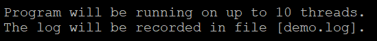

##【HIBLUP】02 计算等位基因频率与基因型频率
###计算等位基因频率
HIBLUP可以使用--allele-freq计算所有个体各SNP位点的等位基因频率。
  
命令行输入  

```
./hiblup --bfile demo --allele-freq --out demo
```

--bfile：指定输入的二进制格式的基因组文件前缀，hiblup接受的文件格式是plink格式，即demo.bed、demo.fam、demo.bim；  

--allele-freq：计算等位基因频率；

--out：指定输出的文件名前缀。


 本次程序运行计算了800个个体1000个SNP位点的等位基因频率，并把结果储存在demo.afreq文件中，程序运行的信息记录在demo.log文件中。

demo.afreq文件格式如下：


第一列为SNP名称，第二列为等位基因1，第三列为等位基因2，第四列为等位基因1占该位点所有等位基因的比例。

由于没有指定线程数，所以hiblup将会默认获取OpenMP环境变量中最大线程数来提高计算效率，这里默认使用32个线程进行计算。

如果需要指定线程数，可以使用--threads指定用于分析的线程数。

```​
./hiblup --bfile demo --allele-freq --threads 10 --out demo
```



###计算基因型频率
HIBLUP可以使用--geno-freq计算所有个体各个SNP位点A1A1和A2A2的频率。

命令行输入

```​
./hiblup --bfile demo --geno-freq --out demo
```  


运行完成后生成demo.gfreq和demo.log两个文件，800个个体1000个SNP位点的A1A1基因型和A2A2基因型的频率数据记录在demo.gfreq文件中。

demo.gfreq文件格式如下：


第一列为SNP名称，第二列为等位基因1，第三列为等位基因2，第四列为基因型A1A1占所有基因型的比例，第五列为基因型A2A2占所有基因型的比例。


​​