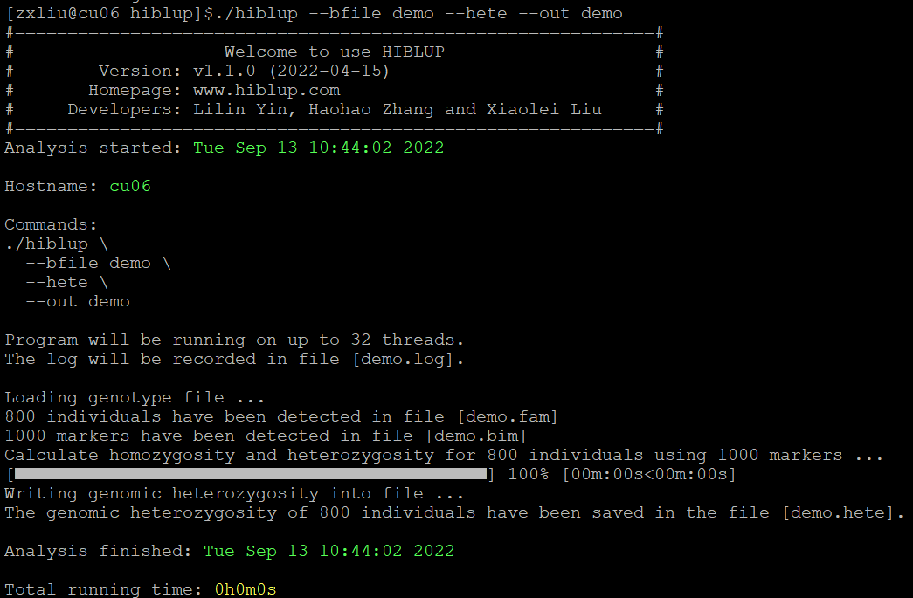

##【HIBLUP】03 计算纯合子和杂合子频率
###计算纯合子频率
HIBLUP可以使用--homo计算个体纯合子的频率。

命令行输入

```​
./hiblup --bfile demo --homo --out demo
```

--bfile：输入二进制基因组文件前缀；

--homo：计算纯合子的频率；

--out：指定输出文件前缀。


运行完成后生成demo.homo文件和demo.log文件。基因组文件中800个个体的纯合子频率保存在demo.homo文件中。

demo.homo文件格式为：


第一列为个体ID，第二列第三列的总和为800个个体所有SNP位点中纯合子的比例。

###计算杂合子频率
HIBLUP中使用--hete计算个体纯合子的频率。

命令行输入

```​
./hiblup --bfile demo --hete --out demo
```

--bfile：输入二进制基因组文件前缀；

--hete：计算杂合子的频率；

--out：指定输出文件前缀。



运行完成后生成demo.hete文件和demo.log文件。基因组文件中800个个体的杂合子频率保存在demo.hete文件中。

demo.hete文件格式为：


第一列为个体ID，第二列为800个个体所有SNP位点中杂合子的比例。

​​