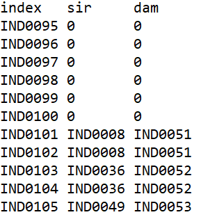
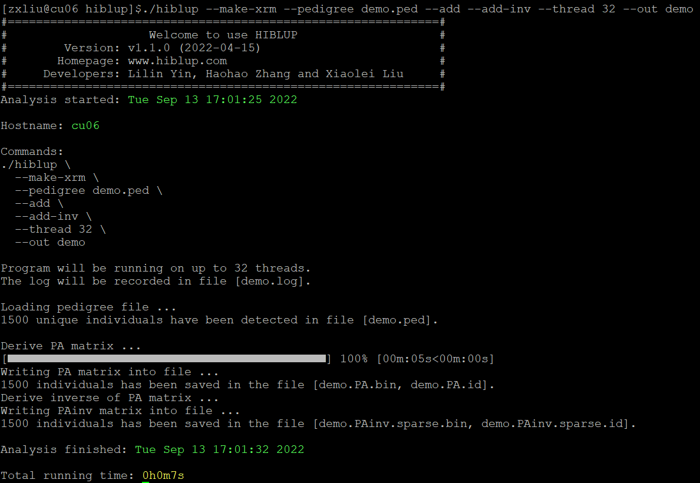

##【HIBLUP】04 构建关系矩阵(PRM)
HIBLUP可以通过--pedgree提供的系谱信息构建系谱关系矩阵。

HIBLUP接受的系谱文件中需要有三列信息。第一列是个体ID，第二列和第三列分别是其父亲和母亲ID。例如demo.ped文件的格式为：



###构建系谱加性关系矩阵及其逆矩阵
命令行输入

```​
./hiblup --make-xrm --pedigree demo.ped --add --add-inv --out demo
```

--make-xrm：构建关系矩阵；

--pedigree：输入系谱文件；

--add：构建加性关系矩阵（A矩阵），默认为true；

--add-inv：构建加性关系矩阵的逆矩阵；

--out：输出文件前缀。



程序运行后生成了demo.PA.bin、 demo.PA.id、demo.PAinv.sparse.bin、 demo.PAinv.sparse.id、demo.log文件。

demo.PA.bin和demo.PAinv.sparse.bin是生成的A矩阵和A矩阵的逆矩阵的二进制文件，demo.PA.id和demo.PAinv.sparse.id是与矩阵相对应的个体ID号，demo.log是日志文件。

HIBLUP在以二进制格式输出生成的矩阵时，对于稠密矩阵，会将矩阵的下三角部分全部输出，每个元素占用4个字节；对于稀疏矩阵，只输出矩阵下三角部分的非零值，每个元素包括其行索引、列索引和值，共占用12个字节。

###构建系谱显性关系矩阵及其逆矩阵
将构建A矩阵及其逆矩阵的命令行代码中--add --add-inv替换成--dom --dom-inv就可以构建系谱的显性关系矩阵及其逆矩阵。

命令行输入

```​
./hiblup --make-xrm --pedigree demo.ped --dom --dom-inv --out demo
```

--make-xrm：构建关系矩阵；

--pedigree：输入系谱文件；

--dom：构建显性关系矩阵（D矩阵）；

--dom-inv：构建显性关系矩阵的逆矩阵；

--out：输出文件前缀。


程序运行后生成了demo.PD.bin、 demo.PD.id、demo.PDinv.sparse.bin、 demo.PDinv.sparse.id、demo.log文件。

D矩阵的运算结果储存在demo.PD.bin文件中，D矩阵的逆矩阵储存在demo.PDinv.sparse.bin文件中，demo.PD.id和demo.PDinv.sparse.id是与矩阵相对应的个体ID号，demo.log为日志文件。

也可以一次性构建多个系谱关系矩阵，同时得到系谱加性关系矩阵、系谱显性关系矩阵及其逆矩阵：

```​
./hiblup --make-xrm --pedigree demo.ped --add --add-inv --dom --dom-inv --out demo
```​