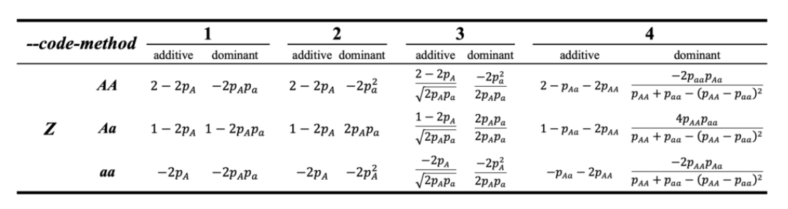
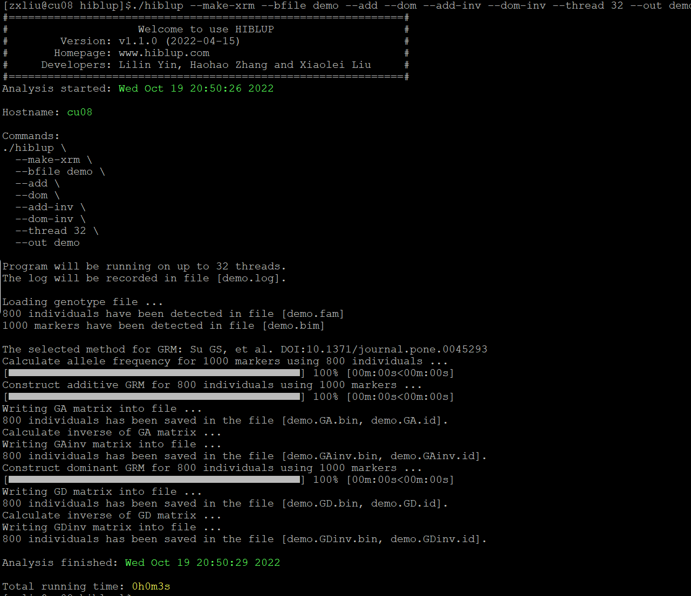
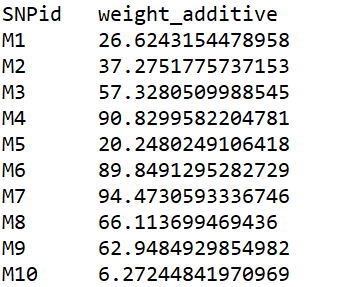
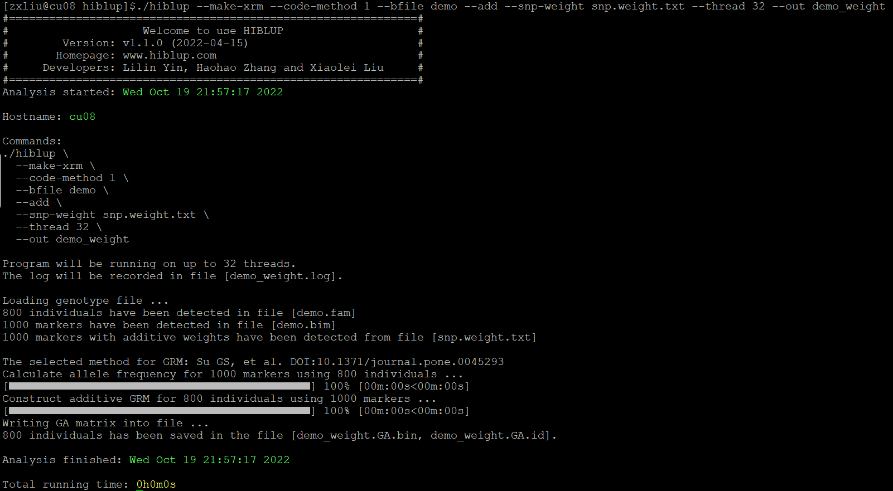
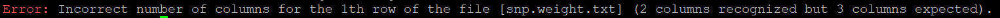

##【HIBLUP】05 构建关系矩阵(GRM)
HIBLUP可以通过--bfile命令提供的全基因组标记信息构建基因组关系矩阵。但HIBLUP接受的基因组文件必须是二进制文件，如HIBLUP提供的测试数据中的demo.bed/demo.fam/demo.bim文件。对于vcf,hapmap,ped/map等格式的文件，可以通过PLINK、TASSEL等软件转换为HIBLUP可以接受的二进制文件后再进行计算。

HIBLUP提供了4种计算加性和显性遗传效应的方法，可以通过--code-method (1,2,3,4)进行选择。



###构建一般基因组关系矩阵
命令行输入

```​
./hiblup --make-xrm --bfile demo --add --dom --add-inv --dom-inv --thread 32 --out demo
```

--make-xrm：构建关系矩阵；

--bfile：输入二进制基因组文件的前缀；

--add：构建加性关系矩阵（A矩阵），默认为true；

--add-inv：构建加性关系矩阵的逆矩阵；

--dom：构建显性关系矩阵（D矩阵）；

--dom-inv：构建显性关系矩阵的逆矩阵；

--thread 32：指定用于分析的线程数；

--out：输出文件前缀。



构建的基因组加性关系矩阵及逆矩阵储存在demo.GA.bin/demo.GAinv.bin文件中；基因组显性关系矩阵及逆矩阵储存在demo.GD.bin/demo.GDinv.bin文件中；demo.GA.id/demo.GD.id/demo.GAinv.id/demo.GDinv.id记录了与矩阵相对应的个体ID；日志文件demo.log.

###构建加权基因组关系矩阵
在有每个SNP的权重数据时，HIBLUP还可以通过--snp-weight输入每个SNP的权重文件来计算加权基因组关系矩阵。输入的权重文件的第一列为SNPid，其余列为SNP的加性权重或显性权重，所有的权重值都应该为正值。



例如snp.weight.txt文件的第一列为SNP的名称，第二列为SNP的加性权重。

输入基因组文件和SNP权重文件计算加权后的基因组关系矩阵：

```​​
./hiblup --make-xrm --code-method 1 --bfile demo --add --snp-weight snp.weight.txt --thread 32 --out demo_weight
```
--make-xrm：构建关系矩阵；

--code-method：选择编码基因型的方法，默认为1；

--bfile：输入二进制基因组文件的前缀；

--add：构建加性关系矩阵（A矩阵），默认为true；

--snp-weight：输入包含所有SNP权重的文件；

--thread 32：指定用于分析的线程数；

--out：输出文件前缀。​



构建的加权的基因组加性关系矩阵储存在demo\_weight.GA.bin文件中；矩阵对应的个体ID储存在demo\_weight.id文件中；日志为demo\_weight.log文件。

在构建加权基因组关系矩阵时要注意，提供的权重数据要与构建的矩阵相对应，计算加权基因组加性关系矩阵时，要提供SNP的加性权重；计算加权基因组显性关系矩阵时，要提供SNP的显性权重；同时计算加权基因组加性和显性关系矩阵时，权重文件中应包含加性和显性权重列，且加性权重在显性权重前。如果提供的权重列数少于所需要的列数，则会报错：

