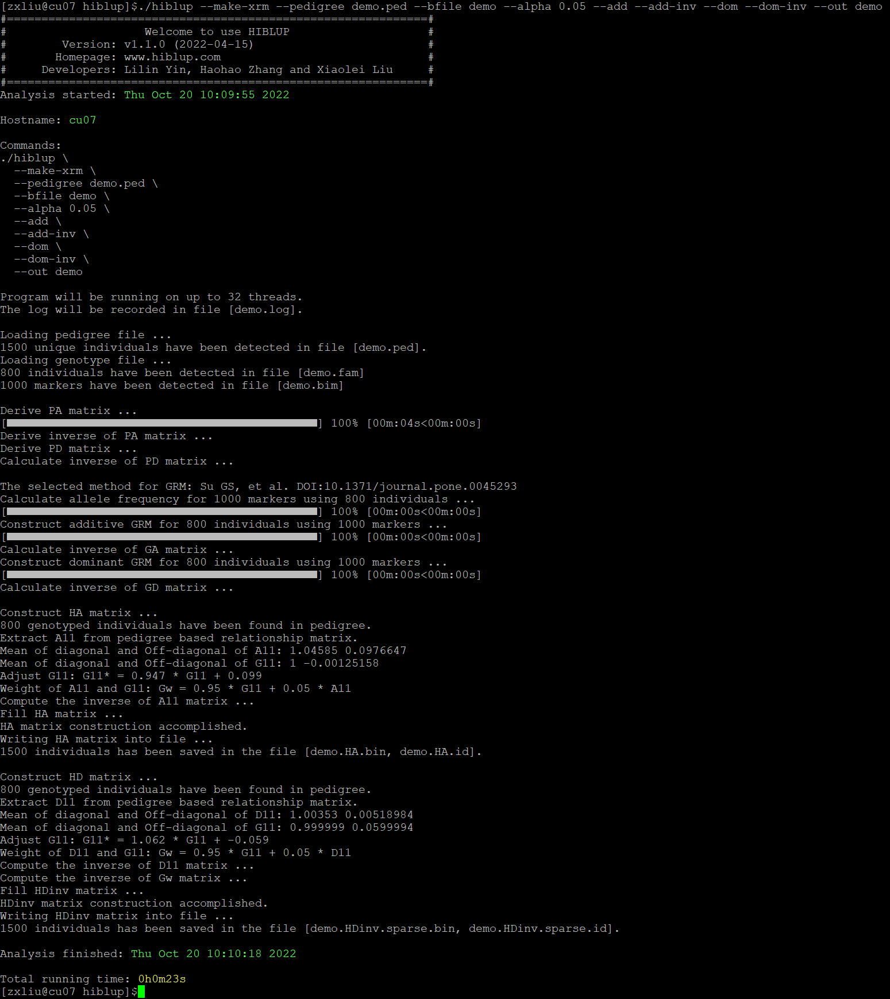

##【HIBLUP】06 构建关系矩阵(HRM)
HIBLUP可以利用基于系谱构建的A矩阵和基于SNP构建的G矩阵构建H矩阵。通过--pedigree和--blife提供系谱文件和二进制基因组文件。

命令行输入

```​
./hiblup --make-xrm --pedigree demo.ped --bfile demo --alpha 0.05 --add --add-inv --dom --dom-inv --out demo
```

--make-xrm：构建关系矩阵；

--pedigree：输入系谱文件；

--bfile：输入二进制基因组文件的前缀；

--alpha：调整构建H矩阵时系谱矩阵所占的权重，默认为0.05；

--add：构建加性关系矩阵（A矩阵），默认为true；

--add-inv：构建加性关系矩阵的逆矩阵；

--dom：构建显性关系矩阵（D矩阵）；

--dom-inv：构建显性关系矩阵的逆矩阵；

--out：输出文件前缀。
​


构建的H矩阵的加性关系矩阵及逆矩阵储存在demo.HA.bin/demo.HAinv.sparse.bin文件中；显性关系矩阵及逆矩阵储存在demo.HD.bin/demo.HDinv.sparse.bin文件中；demo.HA.id/demo.HAinv.sparse.id/demo.HD.id/demo.HDinv.sparse.id记录了与矩阵相对应的个体ID;demo.log是日志文件。

在构建H矩阵时同样可以使用--snp-weight指定构建G矩阵的SNP标记的权重：

```​
./hiblup --make-xrm --pedigree demo.ped --bfile demo --snp-weight snp.weight.txt --alpha 0.05 --add --out demo.weight
```
​