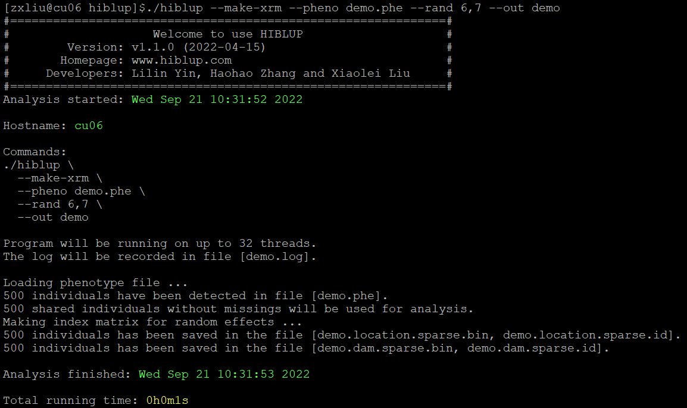

##【HIBLUP】07 构建关系矩阵(环境随机效应关系矩阵)
HIBLUP可以根据提供的系谱信息、基因组信息或已经构建好的关系矩阵中的至少一种遗传随机效应估计遗传随机效应和残差的协方差，而不能直接对环境随机效应进行估计，因此如果需要估计环境随机效应的相关性，可以先根据表型信息构建环境随机效应关系矩阵。

命令行输入：

```
​./hiblup --make-xrm --pheno demo.phe --rand 6,7 --out demo
```

--make-xrm：构建关系矩阵；

--pheno：输入表型文件；

--rand：随机效应在表型文件中列的位置；

--out：输出文件前缀。



运行完成后生成demo.location.sparse.id、demo.location.sparse.bin、demo.dam.sparse.id、demo.dam.sparse.bin、demo.log文件。
​