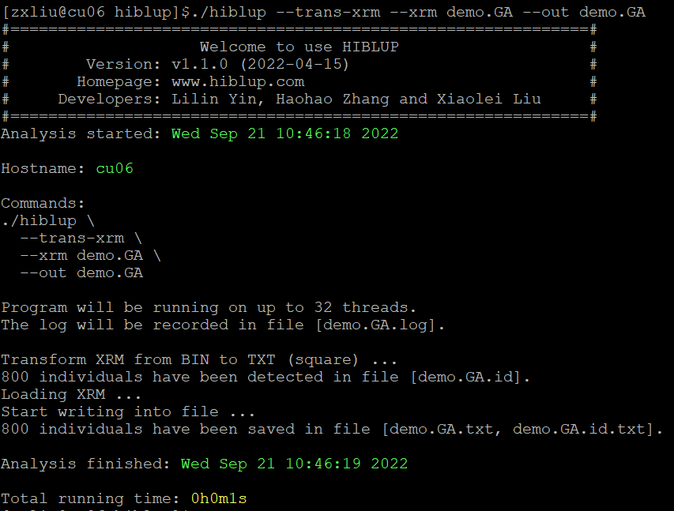
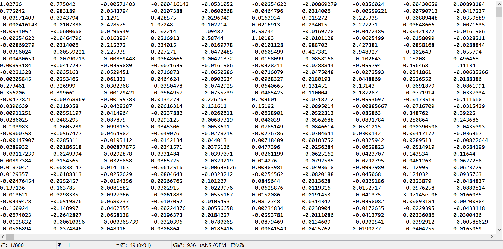
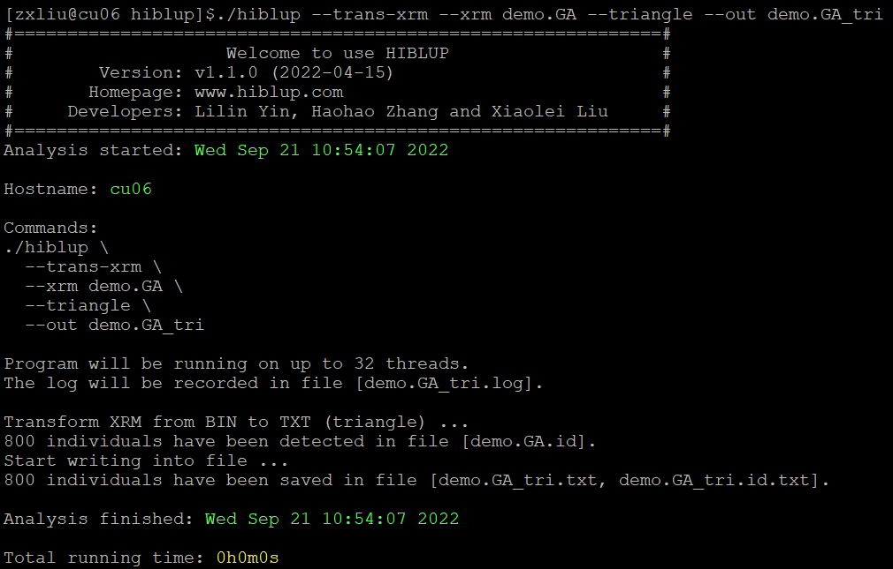
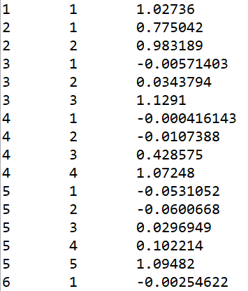
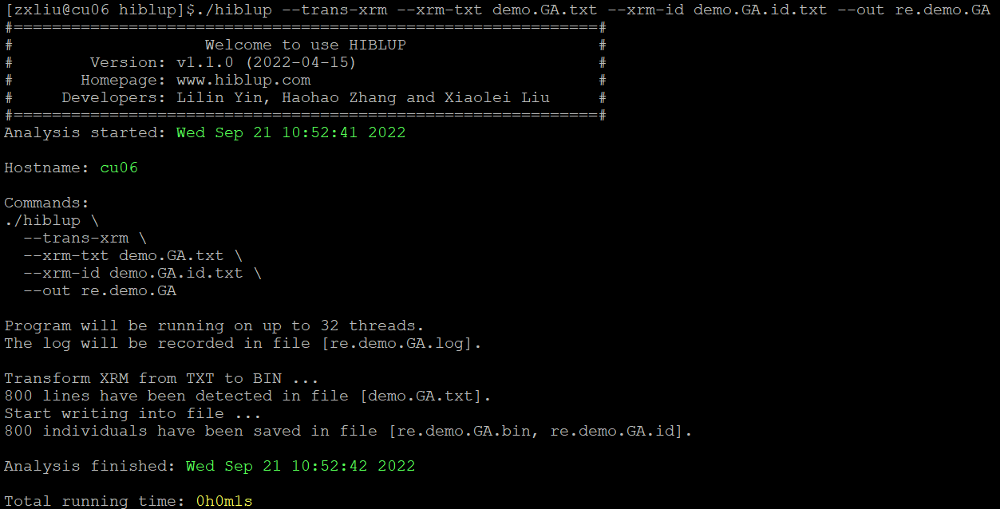

##【HIBLUP】08 XRM格式转换
HIBLUP接受和输出的XRM都是二进制格式，但对于无法识别二进制文件的软件，可以通过HIBLUP提供的格式转换功能，实现二进制文件与文本文件的相互转换。

###二进制文件转文本文件
命令行输入：
```​
./hiblup --trans-xrm --xrm demo.GA --out demo.GA
```

--trans-xrm：格式转换；

--xrm：输入二进制XRM文件前缀；

--out：输出文件前缀。
​


demo.GA.txt为格式转换后的关系矩阵;demo.GA.id.txt相对应的ID号；demo.GA.log为日志文件。

demo.GA.txt：



默认以方阵的形式输出矩阵，也可以通过--triangle以列表的形式输出三角矩阵：

```​
./hiblup --trans-xrm --xrm demo.GA --triangle --out demo.GA_tri
```

--triangle：输入/输出三角矩阵。



生成demo.GA_tri.id.txt、demo.GA_tri.txt、demo.GA_tri.log文件。



demo.GA_tri.txt文件为矩阵的下三角部分，对于稀疏矩阵只输出非零值。第一列为矩阵的行索引，第二列为列索引，第三列为矩阵的值。

###文本文件转二进制文件
将文本文件转换为二进制文件时，命令行输入：

```​
./hiblup --trans-xrm --xrm-txt demo.GA.txt --xrm-id demo.GA.id.txt --out re.demo.GA
```

--xrm-txt：输入文本格式的矩阵文件；

--xrm-id：输入文本格式的ID号。



运行完成后生成二进制矩阵文件re.demo.GA.bin，ID文件re.demo.GA.id和日志文件re.demo.GA.log.

如果输入三联表格式的矩阵文件，进行格式转换时要添加--triangle：

```​
./hiblup --trans-xrm --xrm-txt demo.GA_tri.txt --xrm-id demo.GA_tri.id.txt --triangle --out re.demo.GA_tri
```

​
否则将会报错：

​