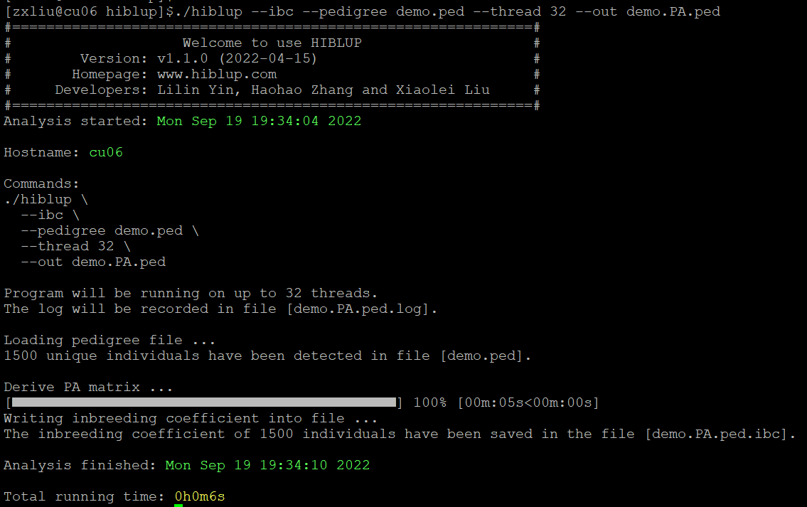
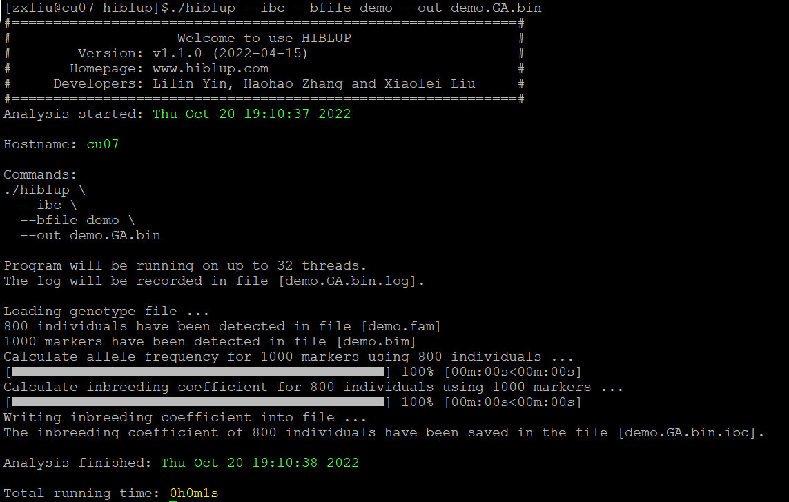
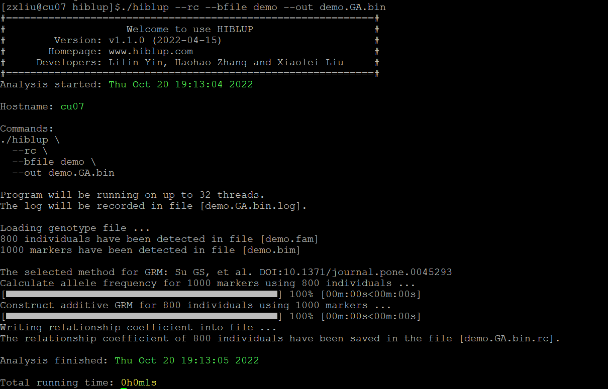
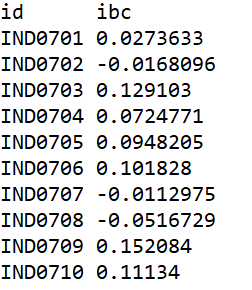
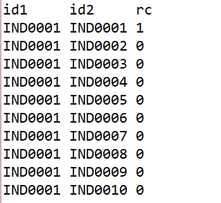

##【HIBLUP】09 计算近交系数与亲缘系数
近交系数是指某一个体任何基因座上两个相同基因来自父母共同祖先同一基因的概率，即该个体由于父母近交可能成为纯合子的概率。

亲缘系数是两个个体间加性基因效应间的相关，表示两个个体拥有来自于共同祖先的统一基因的概率，表明两个体间亲缘关系的远近或遗传相关程度。

近交系数是单个个体的值；亲缘系数是两个个体之间的值。

在数据量比较大时，可以使用HIBLUP用系谱信息构造的A矩阵，或之前生成的PA矩阵计算近交系数或亲缘关系系数。

###计算近交系数
####使用系谱信息计算近交系数
使用系谱文件计算近交系数时，命令行输入：

```​
./hiblup --ibc --pedigree demo.ped --out demo.PA.ped
```

--ibc：计算近交系数；

--pedigree：输入系谱文件；

--out：输出文件前缀。



运行完成后，生成demo.PA.ped.ibc文件和demo.PA.ped.log文件。系谱文件记录的1500个个体的近交系数储存在demo.PA.ped.ibc文件中。

也可以直接输入之前生成的PA矩阵计算个体近交系数：

```​
./hiblup --ibc --xrm demo.PA --out demo.PA.xrm
```

--ibc：计算近交系数；

--xrm：输入关系矩阵；

--out：输出文件前缀。

####使用基因组信息计算近交系数

使用基因组文件计算近交系数时，命令行输入：

```​
./hiblup --ibc --bfile demo --out demo.GA.bin
```

--ibc：计算近交系数；

--bfile：输入基因组文件；

--out：输出文件前缀。



运行完成后，生成demo.GA.bin.ibc文件和demo.GA.bin.log文件。

也可以直接输入之前生成的GA矩阵计算个体近交系数：

```​
./hiblup --ibc --xrm demo.GA --out demo.GA.xrm
```

--ibc：计算近交系数；

--xrm：输入关系矩阵；

--out：输出文件前缀。

###计算亲缘系数
####使用系谱信息计算亲缘系数
使用系谱信息计算亲缘关系系数时，命令行输入：

```​
./hiblup --rc --pedigree demo.ped --out demo.PA.ped
```

--rc：计算亲缘系数；

--pedigree：输入系谱文件；

--out：输出文件前缀。


运行完成后，生成demo.GA.ped.rc文件和demo.GA.ped.log文件，1500个个体间的亲缘系数储存在demo.GA.ped.rc文件中。

使用之前生成的GA矩阵计算亲缘系数：

```​
./hiblup --rc --xrm demo.PA --out demo.PA.xrm
```

--rc：计算亲缘系数；

--xrm：输入关系矩阵；

--out：输出文件前缀。

####使用基因组信息计算亲缘系数
使用基因组文件计算亲缘系数时，命令行输入：

```​
./hiblup --rc --bfile demo --out demo.GA.bin
```

--rc：计算亲缘系数；

--bfile：输入基因组文件；

--out：输出文件前缀。



运行完成后，生成demo.GA.bin.rc文件和demo.GA.bin.log文件。

也可以直接输入之前生成的GA矩阵计算两个个体间的系数：

```​
./hiblup --rc --xrm demo.GA --out demo.GA.xrm
```

--rc：计算近交系数；

--xrm：输入关系矩阵；

--out：输出文件前缀。

运行完成后，生成demo.GA.xrm.rc文件和demo.GA.xrm.log文件。



*.ibc文件的格式为第一列为个体ID，第二列为该个体的近交系数。



*.rc文件的格式为第一列为第一个个体的ID，第二列为第二个个体的ID，第三列为两个个体间的亲缘关系系数。 
​​