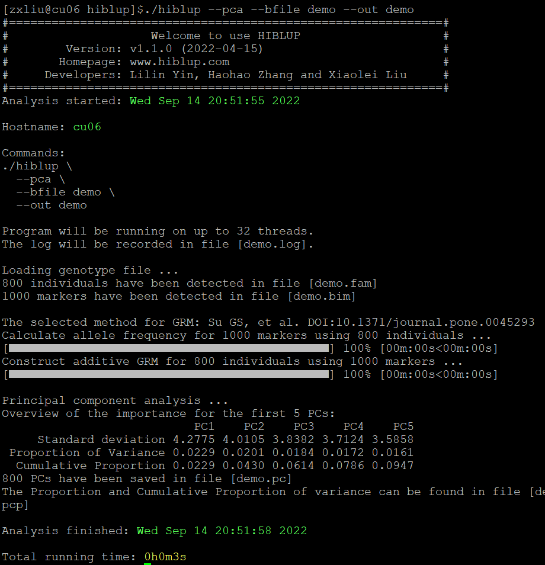

##【HIBLUP】10 主成分分析
主成分分析（Principal Component Analysis，PCA）， 是一种统计方法。通过正交变换将一组可能存在相关性的变量转换为一组线性不相关的变量，转换后的这组变量叫主成分。

HIBLUP可以根据提供的基因组信息或关系矩阵计算群体PCA。

###使用基因组信息计算
命令行输入：

```​
./hiblup --pca --bfile demo --out demo
```

--pca：进行主成分分析；

--bfile：输入基因组文件；

--out：输出文件前缀。



运行完成后，800个个体的主成分储存在demo.pc文件中；标准差、方差比例、累计比例储存在demo.pcp中。

也可以直接输入GA矩阵进行主成分分析：

```​
./hiblup --pca --xrm demo.GA --out demo
```