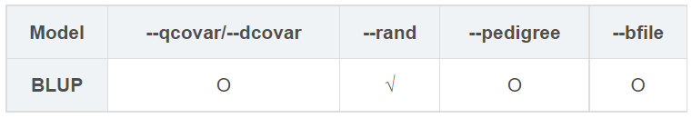
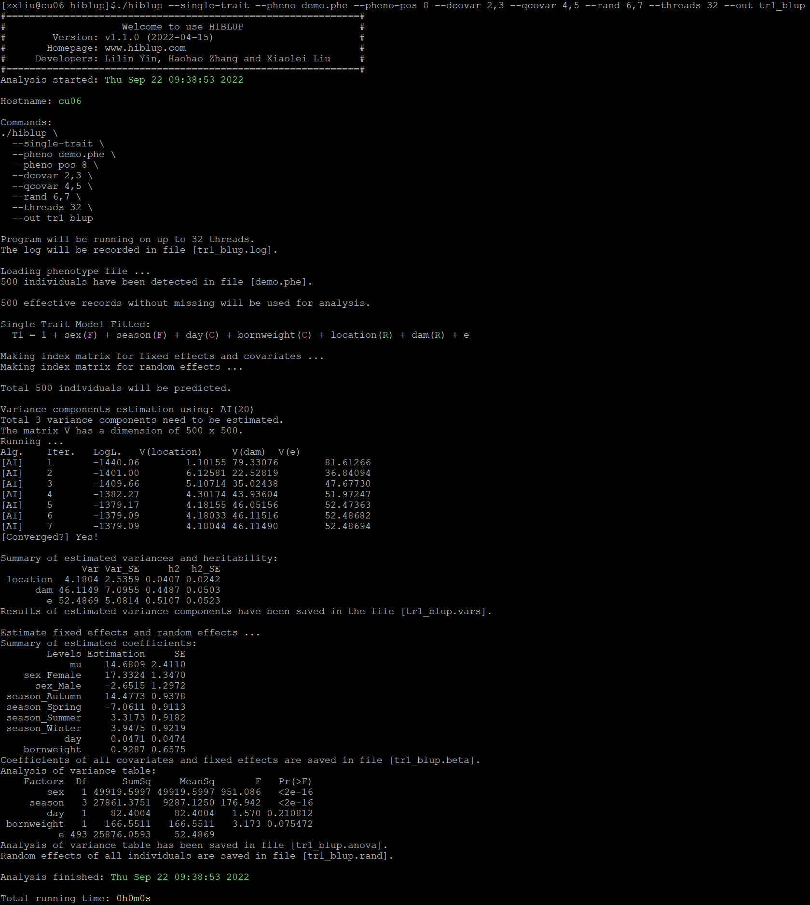
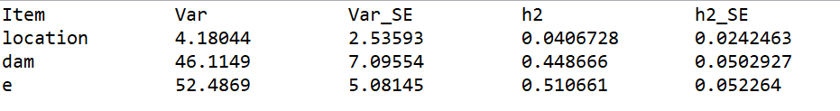

##【HIBLUP】12 单性状模型——BLUP
###拟合BLUP模型


```​
./hiblup --single-trait --pheno demo.phe --pheno-pos 8 --dcovar 2,3 --qcovar 4,5 --rand 6,7 --out tr1_blup
```

--single-trait：拟合单性状模型；

--pheno：包含表头的表型文件的路径和名称；

--pheno-pos：所要分析的表型在表型文件中的位置，默认为2；

--dcovar：离散变量（如性别、年份等）在表型文件中列的位置（可选）；

--qcovar：连续变量（如身高、体重等）在表型文件中列的位置（可选）；

--rand：随机效应在表型文件中列的位置（必需）；

--out：输出文件前缀。



运行完成后生成tr1\_blup.beta、tr1\_blup.anova、tr1\_blup.rand、tr1\_blup.vars、tr1\_blup.log

tr1_blup.beta：记录了固定效应和协变量的估计系数和标准误；

tr1_blup.anova：记录了所有固定效应和协变量的方差分析表；

tr1_blup.rand：记录了表型文件中所有个体的随机效应值。



tr1_blup.vars：记录了方差分量的估计值和遗传力。​