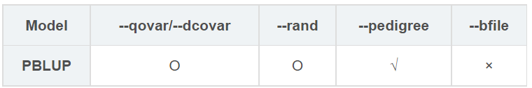
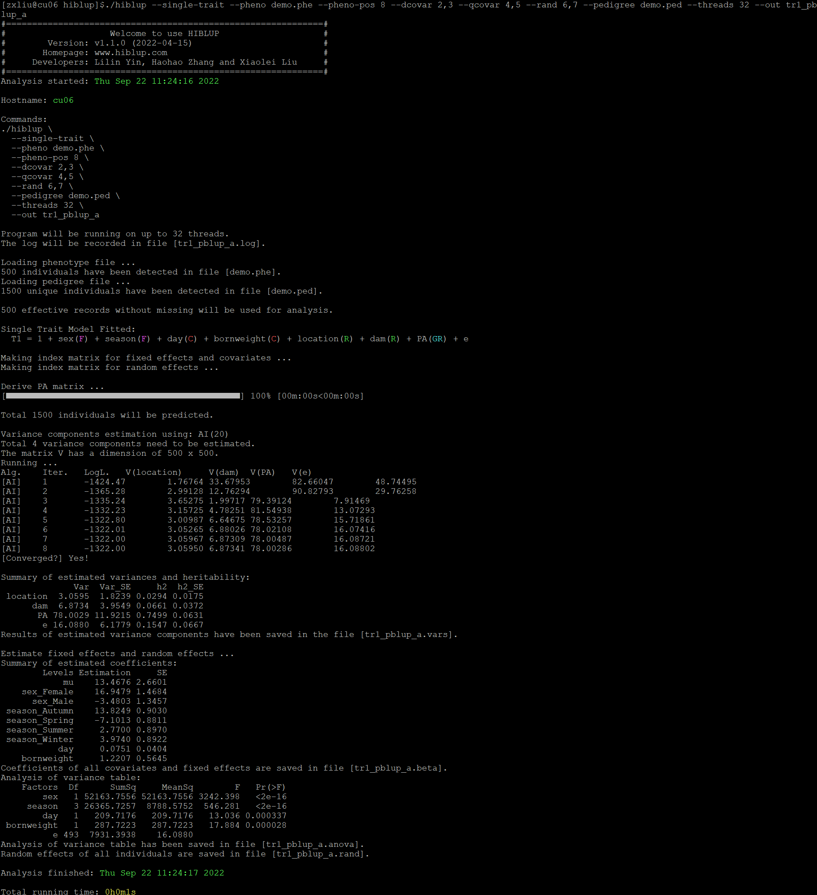
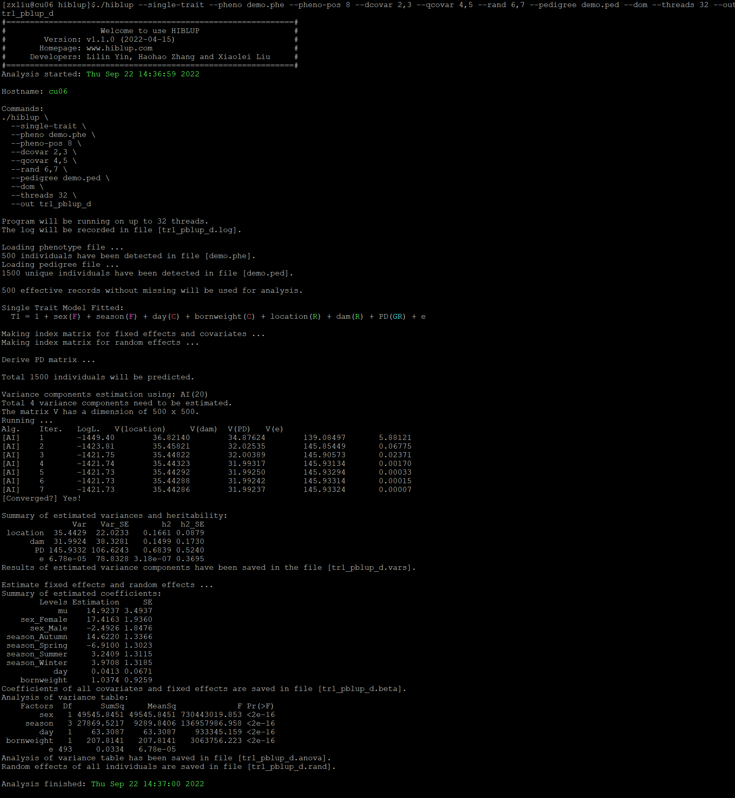

##【HIBLUP】13 单性状模型——PBLUP
###拟合PBLUP模型



```​​
./hiblup --single-trait --pheno demo.phe --pheno-pos 8 --dcovar 2,3 --qcovar 4,5 --rand 6,7 --pedigree demo.ped --out tr1_pblup_a​
```

--single-trait：单性状模型；

--pheno：包含表头的表型文件的路径和名称；

--pheno-pos：所要分析的表型在表型文件中的位置，默认为2；

--dcovar：离散变量（如性别、年份等）在表型文件中列的位置（可选）；

--qcovar：连续变量（如身高、体重等）在表型文件中列的位置（可选）；

--rand：随机效应在表型文件中列的位置（可选）；

--pedigree：输入系谱文件（必需）；

--out：输出文件前缀。



默认使用--add计算A矩阵。运行完成后生成tr1_pblup_a.vars、tr1_pblup_a.rand、tr1_pblup_a.beta、tr1_pblup_a.anova、tr1_pblup_a.log文件。

tr1_pblup_a.beta：记录了固定效应和协变量的估计系数和标准误；

tr1_pblup_a.anova：记录了所有固定效应和协变量的方差分析表；

tr1_pblup_a.rand：记录了表型文件中所有个体的随机效应值。包括环境随机效应、遗传随机效应和残差。

tr1_pblup_a.vars：估计方差分量的结果。

--dom：构建D矩阵:

```​
./hiblup --single-trait --pheno demo.phe --pheno-pos 8 --dcovar 2,3 --qcovar 4,5 --rand 6,7 --pedigree demo.ped --dom --out tr1_pblup_d
```



生成tr1\_pblup\_d.vars、tr1\_pblup\_d.rand、tr1\_pblup\_d.beta、tr1\_pblup\_d.anova、tr1\_pblup\_d.log文件。

--add --dom：同时构建A矩阵和D矩阵

```​
./hiblup --single-trait --pheno demo.phe --pheno-pos 8 --dcovar 2,3 --qcovar 4,5 --rand 6,7 --pedigree demo.ped --add --dom --out tr1_pblup_ad
```


运行完成后生成tr1\_pblup\_ad.vars、tr1\_pblup\_ad.rand、tr1\_pblup\_ad.beta、tr1\_pblup\_ad.anova、tr1\_pblup\_ad.log文件。

在对每个特征进行拟合时，都需要重复构造XRM会降低程序运算的效率，所以可以通过--xrm输入已经构造好的矩阵，多个矩阵中间用逗号隔开。​

```​
./hiblup --single-trait --pheno demo.phe --pheno-pos 8 --dcovar 2,3 --qcovar 4,5 --rand 6,7 --xrm demo.PA --out x_tr1_pblup_a    
```
```
./hiblup --single-trait --pheno demo.phe --pheno-pos 8 --dcovar 2,3 --qcovar 4,5 --rand 6,7 --xrm demo.PD --out x_tr1_pblup_d
```
```./hiblup --single-trait --pheno demo.phe --pheno-pos 8 --dcovar 2,3 --qcovar 4,5 --rand 6,7 --xrm demo.PA,demo.PD --out x_tr1_pblup_ad
```
