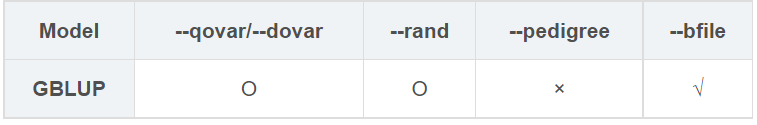
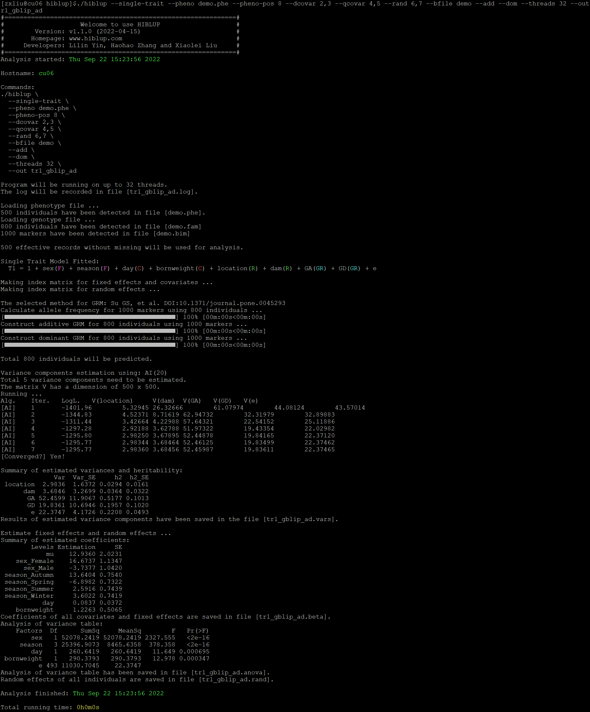

##【HIBLUP】14 单性状模型——GBLUP
###拟合GBLUP模型



拟合GBLUP只需要将拟合PBLUP模型时输入的系谱信息文件替换成基因组文件。

```
./hiblup --single-trait --pheno demo.phe --pheno-pos 8 --dcovar 2,3 --qcovar 4,5 --rand 6,7 --bfile demo --add --dom --threads 32 --out tr1_gblup_ad
```

--single-trait：单性状模型；

--pheno：包含表头的表型文件的路径和名称；

--pheno-pos：所要分析的表型在表型文件中的位置，默认为2；

--dcovar：离散变量（如性别、年份等）在表型文件中列的位置（可选）；

--qcovar：连续变量（如身高、体重等）在表型文件中列的位置（可选）；

--rand：随机效应在表型文件中列的位置（可选）；

--bfile：输入基因组文件（必需）；

--add --dom：构建A矩阵和D矩阵；

--out：输出文件前缀。



运行完成后生成tr1\_gblup\_ad.vars、tr1\_gblup\_ad.rand、tr1\_gblup\_ad.beta、tr1\_gblup\_ad.anova、tr1\_gblup\_ad.log文件。

tr1\_gblup\_ad.beta：记录了固定效应和协变量的估计系数和标准误；

tr1\_gblup\_ad.anova：记录了所有固定效应和协变量的方差分析表；

tr1\_gblup\_ad.rand：记录了表型文件中所有个体的随机效应值。包括环境随机效应、遗传随机效应和残差。

tr1\_gblup\_ad.vars：估计方差分量的结果。

HIBLUP还可以计算和输出随机效应的可靠性和预测误差方差（PEV）。默认情况下，这些统计数据并不会计算和输出，因为准确性估计会增加程序运行的时间，因此只在需要获得准确性时才添加--r2命令。

```​
./hiblup --single-trait --pheno demo.phe --pheno-pos 8 --dcovar 2,3 --qcovar 4,5 --rand 6,7 --bfile demo --r2 --out demo
```

在输出的*.rand文件会输出额外的记录PEV和可靠性的列。

GBLUP也可以输入已经构建好的XRM矩阵来拟合:

```​
./hiblup --single-trait --pheno demo.phe --pheno-pos 8 --dcovar 2,3 --qcovar 4,5 --rand 6,7 --threads 32 --xrm demo.GA --out x_tr1_gblup_a    
```
```./hiblup --single-trait --pheno demo.phe --pheno-pos 8 --dcovar 2,3 --qcovar 4,5 --rand 6,7 --threads 32 --xrm demo.GD --out x_tr1_gblup_d
```
```./hiblup --single-trait --pheno demo.phe --pheno-pos 8 --dcovar 2,3 --qcovar 4,5 --rand 6,7 --threads 32 --xrm demo.GA,demo.GD --out x_tr1_gblup_ad
```

