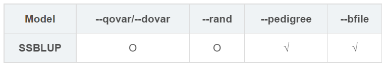
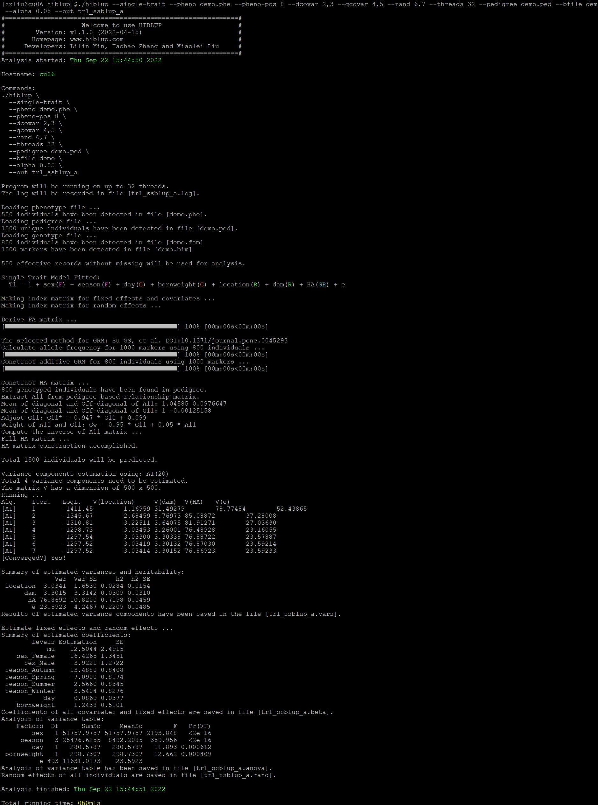

##【HIBLUP】15 单性状模型——SSBLUP
###拟合SSBLUP模型


```​
./hiblup --single-trait --pheno demo.phe --pheno-pos 8 --dcovar 2,3 --qcovar 4,5 --rand 6,7 --threads 32 --pedigree demo.ped --bfile demo --alpha 0.05 --add --dom --out tr1_ssblup_ad
```

--single-trait：单性状模型；

--pheno：包含表头的表型文件的路径和名称；

--pheno-pos：所要分析的表型在表型文件中的位置，默认为2；

--dcovar：离散变量（如性别、年份等）在表型文件中列的位置（可选）；

--qcovar：连续变量（如身高、体重等）在表型文件中列的位置（可选）；

--rand：随机效应在表型文件中列的位置（可选）；

--pedigree：输入系谱文件（必需）；

--bfile：输入基因组文件（必需）；

--alpha：调整构建H矩阵时系谱矩阵所占的权重，默认为0.05；

--add --dom：构建A矩阵和D矩阵；

--out：输出文件前缀。



运行完成后生成tr1\_ssblup\_ad.vars、tr1\_ssblup\_ad.rand、tr1\_ssblup\_ad.beta、tr1\_ssblup\_ad.anova、tr1\_ssblup\_ad.log文件。

tr1\_ssblup\_ad.beta：记录了固定效应和协变量的估计系数和标准误；

tr1\_ssblup\_ad.anova：记录了所有固定效应和协变量的方差分析表；

tr1\_ssblup\_ad.rand：记录了表型文件中所有个体的随机效应值。包括环境随机效应、遗传随机效应和残差。

tr1\_ssblup\_ad.vars：估计方差分量的结果。

SSBLUP也可以输入已经构建好的XRM矩阵进行拟合:

```​
./hiblup --single-trait --pheno demo.phe --pheno-pos 8 --dcovar 2,3 --qcovar 4,5 --rand 6,7 --threads 32 --xrm demo.HA --out x_tr1_ssblup_a    
```
```
./hiblup --single-trait --pheno demo.phe --pheno-pos 8 --dcovar 2,3 --qcovar 4,5 --rand 6,7 --threads 32 --xrm demo.HD --out x_tr1_ssblup_d
```
```
./hiblup --single-trait --pheno demo.phe --pheno-pos 8 --dcovar 2,3 --qcovar 4,5 --rand 6,7 --threads 32 --xrm demo.HA,demo.HD --out x_tr1_ssblup_ad
```
​