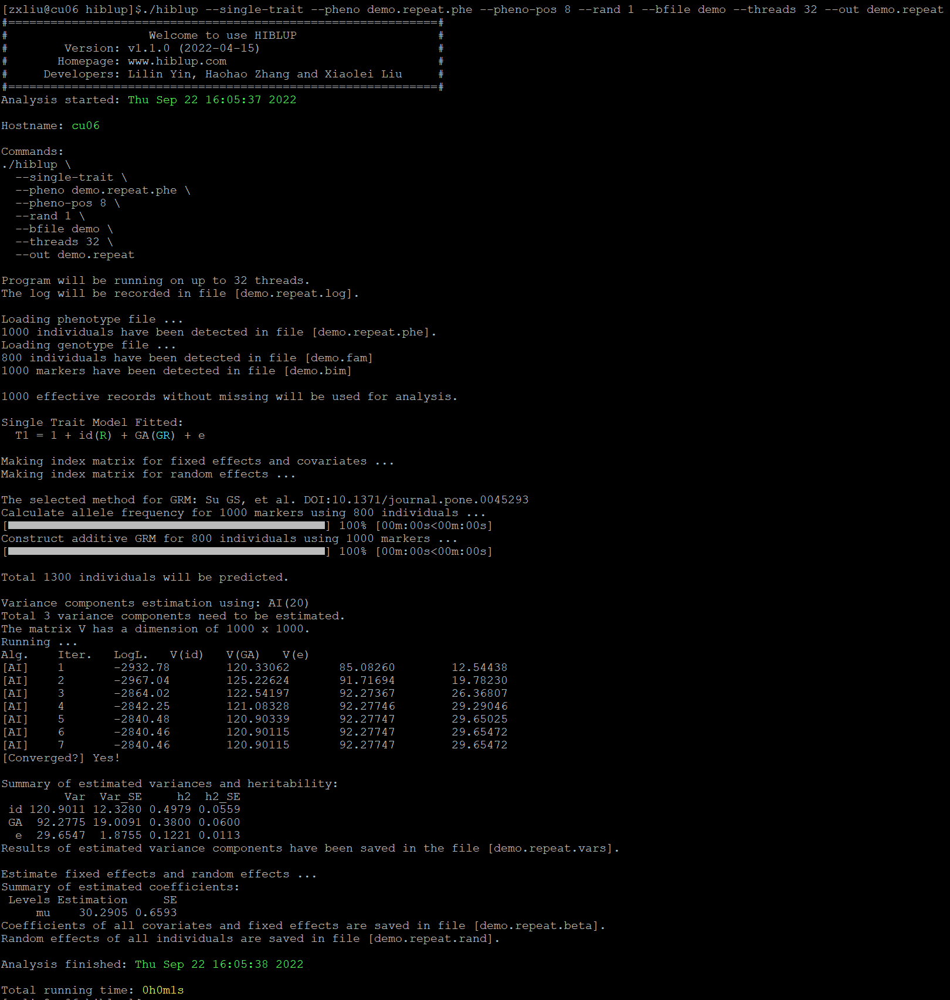

##【HIBLUP】16 单性状模型的重复记录
重复记录模型可以通过将表型文件第一列的个体ID分配给环境随机效应来实现拟合**永久环境效应**。以GBLUP为例：

```​
./hiblup --single-trait --pheno demo.repeat.phe --pheno-pos 8 --rand 1 --bfile demo --out demo.repeat
```



运行完成后生成demo.repeat.beta、demo.repeat.vars、demo.repeat.rand、demo.repeat.log

demo.repeat.beta：记录了估计系数和标准误；

demo.repeat.rand：记录了所有个体的估计的环境随机效应（这里是id）、遗传随机效应和残差；

demo.repeat.vars：记录了估计方差分量的结果。

