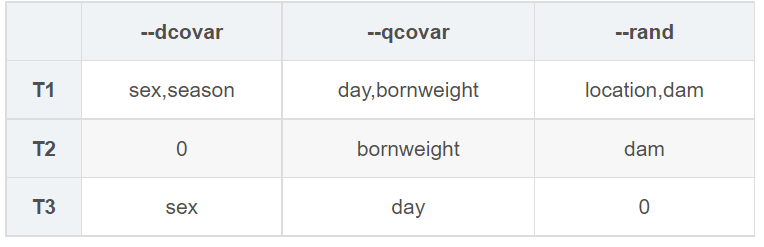
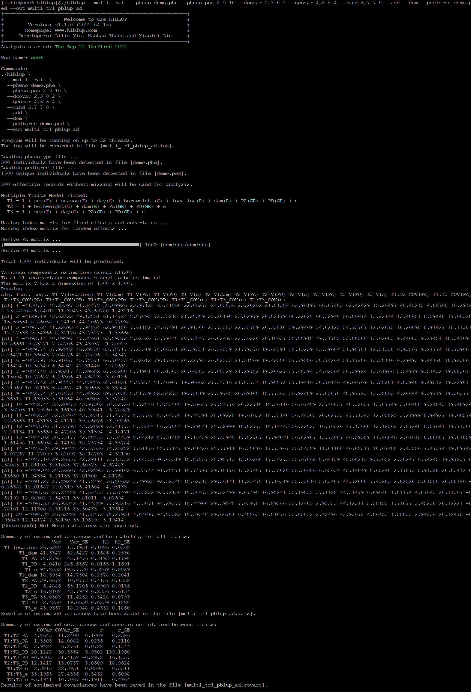

##【HIBLUP】17 多性状模型——PBLUP
多性状模型用于估计性状之间的遗传相关性。可以为不同的性状指定不同的固定效应、协变量和随机效应。PBLUP、GBLUP、SSGBLUP都可用于多性状模型。

###PBLUP模型
命令行输入：

```​
./hiblup --multi-trait --pheno demo.phe --pheno-pos 8 9 10 --dcovar 2,3 0 2 --qcovar 4,5 5 4 --rand 6,7 7 0 --add --dom --pedigree demo.ped --out multi_tr1_pblup_ad
```


--multi-trait：多性状模型；

--pheno：包括表头的表型文件的路径和名称；

--pheno-pos：分析的表型在表型文件列中的位置，默认值为2；

--dcovar/--qcovar/--rand：在多性状模型中--qcovar，--dcovar，--rand赋值规则：**同一个性状内用逗号隔开**，性状间用空格，当某个性状不存在固定效应，或协变量，或者随机效应时，用0代替。

--add --dom：同时构建A矩阵和D矩阵；

--pedigree：输入系谱文件；

--out：输出文件前缀。



运行完成后生成文件multi\_tr1\_pblup\_ad.covars、multi\_tr1\_pblup\_ad.log、multi\_tr1\_pblup\_ad.vars、multi\_tr1\_pblup\_ad.\*.rand、multi\_tr1\_pblup\_ad.\*.beta、multi\_tr1\_pblup\_ad.\*.anova

multi\_tr1\_pblup\_ad.covars：记录性状之间（加性遗传效应、显性遗传效应、残差）的估计协方差及标准误和遗传相关性及标准误；

multi\_tr1\_pblup\_ad.vars：记录所有性状的随机效应方差及标准误和遗传力及标准误；

multi\_tr1\_pblup\_ad.\*.rand：记录了所有个体的随机效应值和残差；

multi\_tr1\_pblup_ad.*.anova：记录了所有固定效应和协变量的方差分析表；

multi\_tr1\_pblup_ad.*.beta：记录了固定效应和协变量的估计系数和标准误；


多性状模型也可以输入已经构建好的矩阵:
```​
./hiblup --multi-trait --pheno demo.phe --pheno-pos 8 9 10 --dcovar 2,3 0 2 --qcovar 4,5 5 4 --rand 6,7 7 0 --xrm demo.PA,demo.PD --out x_multi_tr1_pblup_ad
```

```​
./hiblup --multi-trait --pheno demo.phe --pheno-pos 8 9 10 --dcovar 2,3 0 2 --qcovar 4,5 5 4 --rand 6,7 7 0 --xrm demo.PA --out x_multi_tr1_pblup_a
```

```
./hiblup --multi-trait --pheno demo.phe --pheno-pos 8 9 10 --dcovar 2,3 0 2 --qcovar 4,5 5 4 --rand 6,7 7 0 --xrm demo.PD --out x_multi_tr1_pblup_d
```
​​