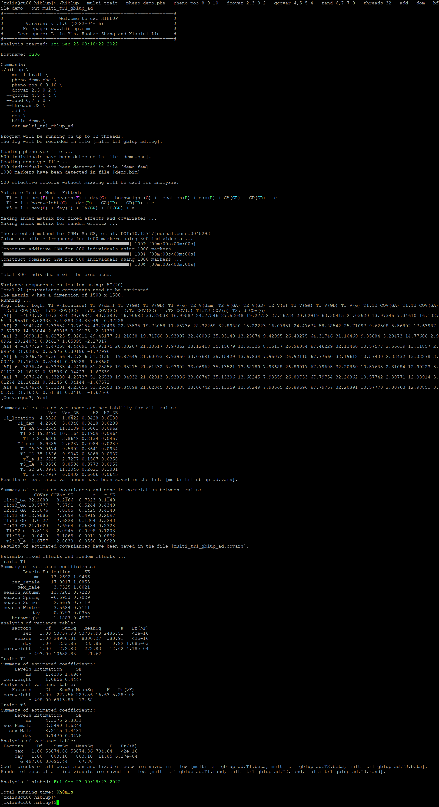
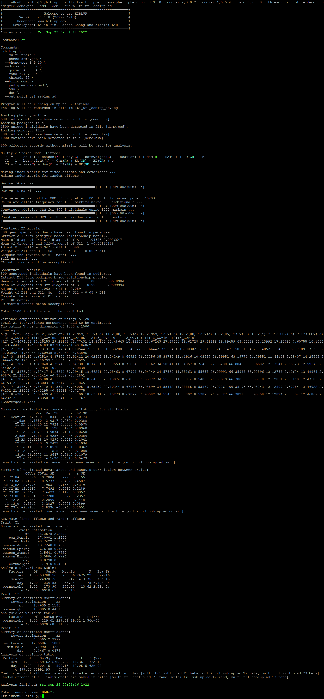

##【HIBLUP】18 多性状模型——GBLUP、SSBLUP
###GBLUP模型
只需要将PBLUP模型中--pedigree替换成--bfile输入二进制的基因组文件前缀，命令行输入：

```​
./hiblup --multi-trait --pheno demo.phe --pheno-pos 8 9 10 --dcovar 2,3 0 2 --qcovar 4,5 5 4 --rand 6,7 7 0 --add --dom --bfile demo --out multi_tr1_gblup_ad
```



运行完成后生成文件multi\_tr1\_gblup\_ad.covars、multi\_tr1\_gblup\_ad.log、multi\_tr1\_gblup\_ad.vars、multi\_tr1\_gblup\_ad.\*.rand、multi\_tr1\_gblup\_ad.\*.beta、multi\_tr1\_gblup\_ad.\*.anova

multi\_tr1\_gblup\_ad.covars：记录性状之间（加性遗传效应、显性遗传效应、残差）的估计协方差及标准误和遗传相关性及标准误；

multi\_tr1\_gblup\_ad.vars：记录所有性状的随机效应方差及标准误和遗传力及标准误；

multi\_tr1\_gblup\_ad.\*.rand：记录了所有个体的随机效应值和残差；

multi\_tr1\_gblup_ad.*.anova：记录了所有固定效应和协变量的方差分析表；

multi\_tr1\_gblup_ad.*.beta：记录了固定效应和协变量的估计系数和标准误；


或者输入已经构建好的GA矩阵和GD矩阵:

```
./hiblup --multi-trait --pheno demo.phe --pheno-pos 8 9 10 --dcovar 2,3 0 2 --qcovar 4,5 5 4 --rand 6,7 7 0 --threads 32 --xrm demo.GA --out x_multi_tr1_gblup_a
```

```
./hiblup --multi-trait --pheno demo.phe --pheno-pos 8 9 10 --dcovar 2,3 0 2 --qcovar 4,5 5 4 --rand 6,7 7 0 --threads 32 --xrm demo.GD --out x_multi_tr1_gblup_d
```

```
./hiblup --multi-trait --pheno demo.phe --pheno-pos 8 9 10 --dcovar 2,3 0 2 --qcovar 4,5 5 4 --rand 6,7 7 0 --threads 32 --xrm demo.GA,demo.GD --out x_multi_tr1_gblup_ad
```
###SSBLUP模型
SSBLUP需要同时输入基因组文件和系谱文件：

```​
./hiblup --multi-trait --pheno demo.phe --pheno-pos 8 9 10 --dcovar 2,3 0 2 --qcovar 4,5 5 4 --rand 6,7 7 0 --bfile demo --pedigree demo.ped --add --dom --out multi_tr1_ssblup_ad
```


运行完成后生成文件multi\_tr1\_ssblup\_ad.covars、multi\_tr1\_ssblup\_ad.log、multi\_tr1\_ssblup\_ad.vars、multi\_tr1\_ssblup\_ad.\*.rand、multi\_tr1\_ssblup\_ad.\*.beta、multi\_tr1\_ssblup\_ad.\*.anova

multi\_tr1\_ssblup\_ad.covars：记录性状之间（加性遗传效应、显性遗传效应、残差）的估计协方差及标准误和遗传相关性及标准误；

multi\_tr1\_ssblup\_ad.vars：记录所有性状的随机效应方差及标准误和遗传力及标准误；

multi\_tr1\_ssblup\_ad.\*.rand：记录了所有个体的随机效应值和残差；

multi\_tr1\_ssblup_ad.*.anova：记录了所有固定效应和协变量的方差分析表；

multi\_tr1\_ssblup_ad.*.beta：记录了固定效应和协变量的估计系数和标准误；


输入已经构建好的HA矩阵和HD矩阵:
```​
./hiblup --multi-trait --pheno demo.phe --pheno-pos 8 9 10 --dcovar 2,3 0 2 --qcovar 4,5 5 4 --rand 6,7 7 0 --threads 32 –xrm demo.HA --out x_multi_tr1_ssblup_a
```

```
./hiblup --multi-trait --pheno demo.phe --pheno-pos 8 9 10 --dcovar 2,3 0 2 --qcovar 4,5 5 4 --rand 6,7 7 0 --threads 32 --xrm demo.HD --out x_multi_tr1_ssblup_d
```

```
./hiblup --multi-trait --pheno demo.phe --pheno-pos 8 9 10 --dcovar 2,3 0 2 --qcovar 4,5 5 4 --rand 6,7 7 0 --threads 32 --xrm demo.HD,demo.HA --out x_multi_tr1_ssblup_ad
```
​​​​