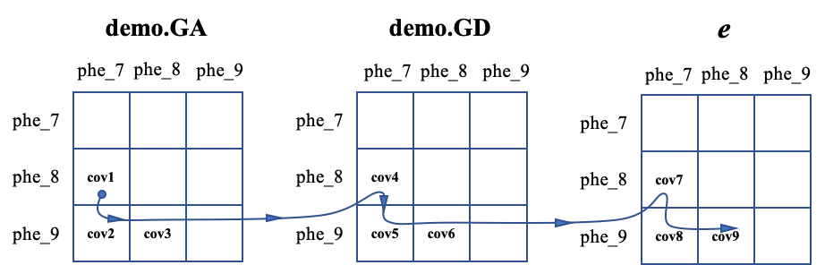

##【HIBLUP】19 求解混合模型方程
求解混合模型的目的是利用已知的遗传参数获得所有个体的估计育种值。HIBLUP根据指定标志--pheno-pos的长度自动切换到单性状或多性状模型。
###求解单性状模型的混合模型
以GBLUP为例，命令行输入：

```​
./hiblup --mme --pheno demo.phe --pheno-pos 8 --dcovar 2,3 --qcovar 4,5 --rand 6,7 --bfile demo --add --vc-priors 12.0397,20.2805,79.9897,12.8864 --out mme_s_gblup
```

--mme：求解具有给定方差分量的混合模型方程；

--pheno：包含表头的表型文件的路径和名称；

--pheno-pos：所要分析的表型在表型文件中的位置，默认为2。多个性状用逗号作为分隔符；

--dcovar：离散变量（如性别、年份等）在表型文件中列的位置；

--qcovar：连续变量（如身高、体重等）在表型文件中列的位置；

--rand：随机效应在表型文件列中的位置；

--bfile：输入基因组文件；

--add：加性遗传效应；

--vc-prior,--vc-priors v1,v2,v3,v4：所有性状的随机效应方差，包括环境随机效应、遗传随机效应（GA、GD）和残差，提供的方差分量也应按此顺序排列。单性状用逗号作分隔符；v1：表型文件第6列的环境随机效应的方差；v2：表型文件第7列的环境随机效应的方差；v3：加性遗传方差；v4：残差；

拟合GBLUP模型的*.vars文件的第1列；


​
--out：输出文件前缀。


运行完成后生成mme_s_gblup.anova、mme_s_gblup.beta、mme_s_gblup.log、mme_s_gblup.rand文件。

mme_s_gblup.beta：记录了固定效应和协变量的估计系数和标准误；

mme_s_gblup.anova：记录了所有固定效应和协变量的方差分析表；

mme_s_gblup.rand：所有个体的估计的环境随机效应、遗传随机效应和残差。

###求解多性状模型的混合模型
命令行输入：

```​
./hiblup --mme --pheno demo.phe --pheno-pos 8 9 10 --dcovar 2,3 0 2 --qcovar 4,5 5 4 --rand 6,7 7 0 --bfile demo --add --dom --vc-priors 13.5473,2.82875,51.7152,37.1667,9.8843 3.60212,49.8403,49.5701,9.98666 15.3899,20.6922,58.508 --covc-priors 34.4808,16.4458,8.99831 34.6178,-2.52686,11.0335 0.226874,-1.12178,-4.79143 --out mme_m_gblup
```

--vc-prior,--vc-priors t1\_v1,t1\_v2,t1\_v3,....：所有性状的随机效应方差，包括环境随机效应、遗传随机效应和残差，提供的方差分量也应按此顺序排列。同一个性状内用逗号作分隔符，性状间用空格作分隔符。t1\_v1：性状1表型文件第6列的环境随机效应的方差；t1\_v2：性状1表型文件第7列的环境随机效应的方差；t1\_v3：性状1加性遗传方差；t1\_v4：性状1显性遗传方差；t1\_v5：性状1残差；t2\_v1：性状2表型文件第7列的环境随机效应的方差；t2\_v2：性状2加性遗传方差；t2\_v3：性状2显性遗传方差；t2\_v4：性状2残差；t3\_v1：性状3加性遗传方差；t3\_v2：性状3显性遗传方差；t3\_v3：性状3残差；

拟合多性状GBLUP模型的*.vars文件的第1列；


---covc-prior,--covc-priors：所有遗传随机效应（包含残差）上各性状间的协方差，如3个性状，顺序为（tr1-tr2,tr1-tr3,tr2-tr3)，同一个遗传随机效应内用逗号隔开，不用随机效应间用空格;

拟合多性状GBLUP模型的*.covars文件的第1列；




如图所示，每个框代表一种遗传随机效应，非对角线是这种遗传随机效应下各性状之间的协方差，而对角线则是不同性状的方差，在输入协方差的顺序应严格遵循上图中的路线。


运行完成后生成mme\_m\_gblup.\*.anova、mme\_m\_gblup.\*.beta、mme\_m\_gblup.\*.rand、mme\_m\_gblup.log文件。

mme\_m\_gblup.*.anova：记录了所有固定效应和协变量的方差分析表；

mme\_m\_gblup.*.beta：记录了固定效应和协变量的估计系数和标准误；

mme\_m\_gblup.*.rand：记录了个体的估计的环境随机效应、遗传随机效应和残差。