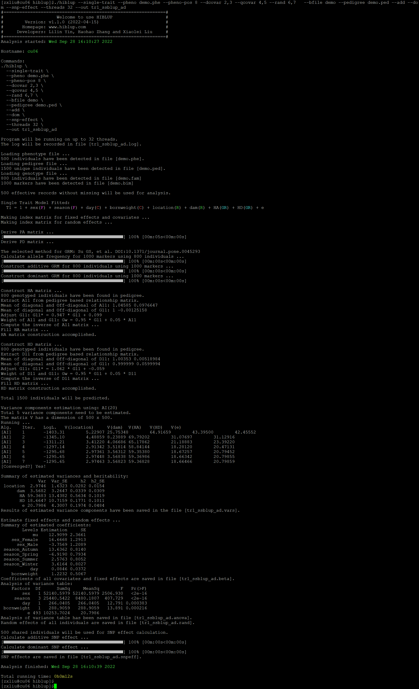

##【HIBLUP】20 计算SNP效应
HIBLUP有两种方法可以计算所有SNP的加性效应和显性效应。
###在拟合单性状、多性状或求解混合模型（MME）时，在命令行中添加--snp-effect
计算加性和显性SNP效应，命令行输入：

```​
./hiblup --single-trait --pheno demo.phe --pheno-pos 8 --dcovar 2,3 --qcovar 4,5 --rand 6,7 --bfile demo --pedigree demo.ped --add --dom --snp-effect --out tr1_ssblup_ad
```

--snp-effect：计算并输出SNP效应。
​


运行完成后生成tr1\_ssblup\_ad.anova、tr1\_ssblup\_ad.beta、tr1\_ssblup\_ad.log、tr1\_ssblup\_ad.rand、tr1\_ssblup\_ad.snpeff、tr1\_ssblup\_ad.vars文件。

tr1\_ssblup\_a.anova：记录了所有固定效应和协变量的方差分析表；

tr1\_ssblup\_a.beta：记录了固定效应和协变量的估计系数和标准误；

tr1\_ssblup\_a.rand：记录了所有个体的估计的环境随机效应、遗传随机效应和残差。

tr1\_ssblup\_a.vars：记录了随机效应的方差分量估计值；

tr1\_ssblup\_a.snpeff：记录了等位基因A1的频率和加性、显性SNP效应值。

###从之前计算的GEBV中得出SNP效应：当提供计算好的育种值时，可直接计算标记效应值

需要计算XRM：

```​
./hiblup --snp-effect --gebv demo.gebv.d.txt --bfile demo –dom  --out demo
```

--snp-effect：计算并输出SNP效应；

--gebv：包含表头的基因组估计育种值文件；

提供之前计算的XRM，不需要计算XRM：

```​
./hiblup --snp-effect --gebv demo.gebv.ad.txt --bfile demo --xrm demo.GA,demo.GD --add --dom --out demo
```
​