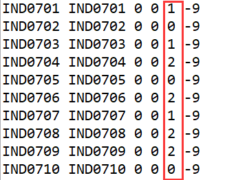
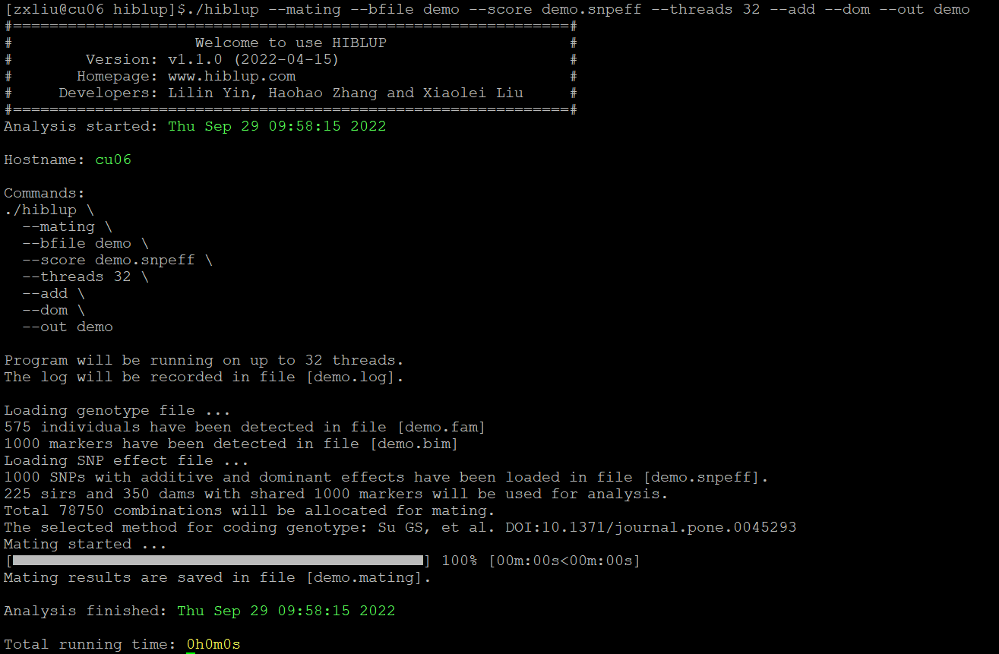
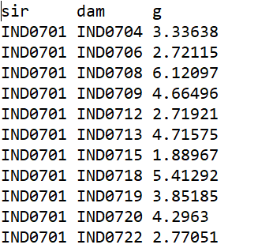

##【HIBLUP】21 基因组选配
基因组选配是将所有可用SNP联合起来用于预测雄性和雌性之间所有组合的后代的预期遗传表现。需要提供所有个体的基因型和所有SNP的加性或显性效应。命令行输入：

```​
./hiblup --mating --bfile demo --score demo.snpeff --out demo
```

--mating:进行基因组选配；

--score：输入估计SNP效应值，第一列是SNP id，其余列是SNP效应，应包含表头；


当直接直接输入基因组文件时程序会发生报错，因为基因组选配的个体都需要明确标明性别1或2，1为雄性个体，2为雌性个体，而demo.fam文件性别列还存在数值为0（即性别未知）的个体，在进行基因组选配时需要过滤掉这部分的个体。



可以在R中提取性别列已知的个体，形成新的demo.fam文件：

​
fam<-read.table("demo.fam")  
n<-which(fam[,5]!=0)  
x<-fam[n,]
write.table(x, file ="demo.fam", sep ="\t", row.names =FALSE, col.names =FALSE, quote =FALSE)




重新运行命令行代码后得到demo.mating和demo.log文件，demo.mating格式如下：



文件第一列为雄性个体ID，第二列为雌性个体ID，第三列为不同双亲组合产生的子代预期的遗传表现。​​