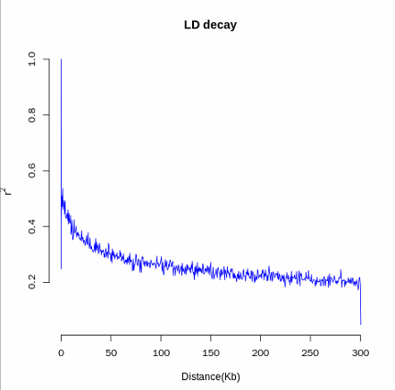
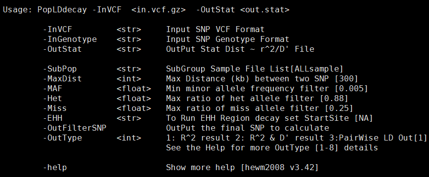
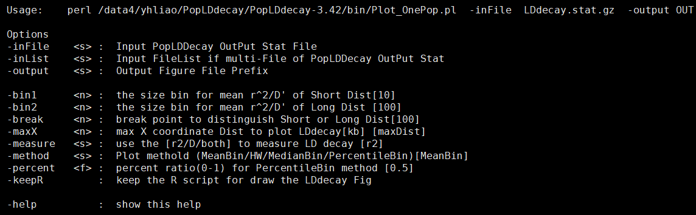
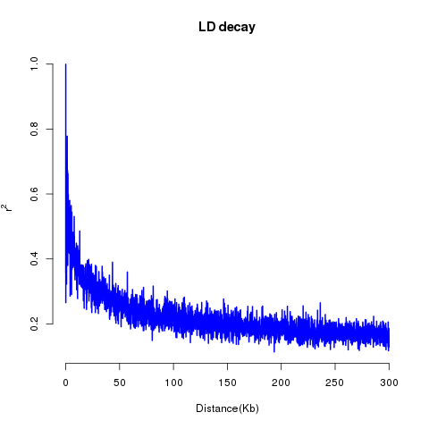
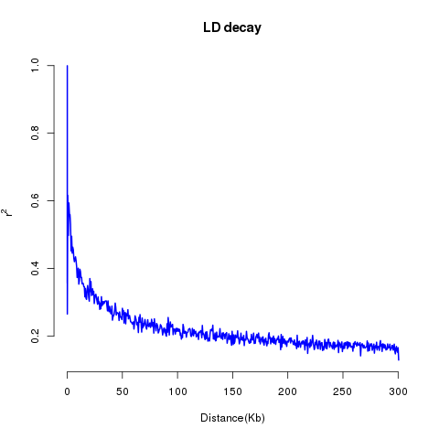
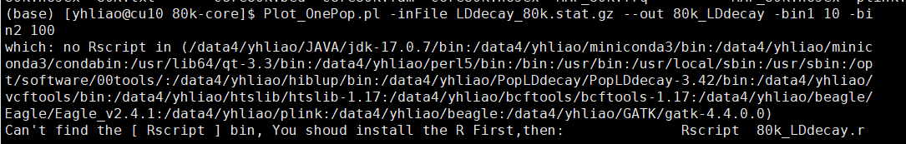
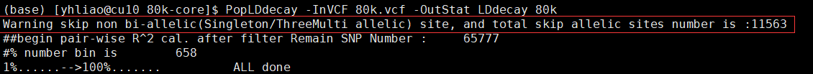

# <u>[PopLDdecay](https://github.com/BGI-shenzhen/PopLDdecay)</u>

## 背景

> LD衰减是由于连锁不平衡所致，LD衰减速度在不同物种或者不同亚种中差异不同，通常用LD衰减到一般的距离来作为群体的衰减距离（还有其它计算方法），如果LD衰减很快，则在进行GWAS分析时需要更多的位点才能达到一定的精度（https://blog.csdn.net/yijiaobani/article/details/122812786）。另外，LD衰减也可以反应群体受选择的情况，一般来说，野生群体比驯化改良群体LD衰减快，异花授粉比自花授粉植物LD衰减快。



> **为什么要检测LD衰减？**
>
> - LD衰减描述了基因组中不同位置的两个等位基因之间的关联程度如何随距离的增加而减少。这有助于了解基因组的结构特性，如基因组区域的重组率。
> - LD水平与有效种群大小（Ne）有关。较高的LD水平可能意味着较小的有效种群大小，而较低的LD水平可能意味着较大的有效种群大小。通过分析LD衰减，我们可以估计种群的历史和现存的有效种群大小。
> - LD衰减的异常模式可能是选择性压力的证据。例如，选择性清除或阳性选择可能导致特定区域的LD异常增加。
> - 在进行基因组关联研究（GWAS）时，了解LD模式对选择合适的标记、解释关联信号以及确定真正的致病变异都非常重要。
> - 在某些遗传结构分析中，过高的LD可能导致结果偏倚。了解LD模式有助于数据减少，即选择那些不在高LD区域的标记，以获得更准确的结构分析结果。
>
> 
>
> **LD衰减距离**
>
> 实际上，LD衰减的速度在不同物种间或同物种的不同亚群体间，往往差异非常巨大。所以，通常会使用1个标准——“LD衰减距离”来描述LD衰减速度的快慢。
>
> LD衰减距离通常指的是：当平均LD系数衰减到一定大小的时候，对应的物理距离。
>
> “一定大小”是这个定义的关键点，但没有特别统一的标准，在不同文章中标准不同。常见的标准包括：a）LD系数降低到最大值的一半；b）LD系数降低到0.5以下；c）LD系数降低到0.1以下；d）LD系数降低到基线水平（但注意，不同材料的基线值是不同的。比如图3黄瓜群体的基线大概是0.1）。
>
> 所以，下次你在文章中看到“LDdecay distance is XXkb”的时候，别忘了看看作者使用的标准是什么。
>
> 

> **LD衰减会受什么的影响？**
>
> 如图3所示， LD系数衰退速度会受到不同因素的影响而有所不同。常见的因素包括：
>
> **1）物种类型LD存在的本质是两个位点的连锁遗传导致的相关性。**但这种相关性理论上会随着世代的增加、重组次数的增加而不断下降。所以，那些繁殖力强、时代间隔短的物种（例如，昆虫），其LD衰减的速度是非常快的。例如在家蚕和野蚕群体中，LD系数下降到最大值的1/2仅仅需要46bp和7bp的距离[3]。
>
> **2）群体类型相同物种的不同群体，由于其遗传背景不同，LD衰减速度也存在很大的差异**。驯化选择，会导致群体遗传多样性下降，位点间的相关性（连锁程度）加强。所以，通常驯化程度越高，选择强度越大的群体，LD衰减速度是最慢的。例如，栽培稻比野生稻通常更大的LD衰减距离。类似的，自然选择、遗传漂变导致的群体遗传多样性下降，也会减慢LD衰减的速度。
>
> **3）在染色体的位置染色体不同区域的LD衰减距离而是不同的。**通常着丝粒区更难重组，所以LD衰减更慢。而基因组上那些受选择的区域相比普通的区域，LD衰减速度也是更慢的[3]。

## 简介

> **PopLDdecay 是什么？**
>
> PopLDdecay 是一个用于分析群体中连锁不平衡衰减的软件。连锁不平衡是指两种等位基因在群体中一起出现的频率高于随机预期值的现象。连锁不平衡衰减是指随着距离的增加，连锁不平衡的强度逐渐减弱的现象。
>
> **PopLDdecay 的功能**
>
> PopLDdecay 可以用于以下任务：
>
> - 计算连锁不平衡衰减的参数，例如衰减率和衰减长度。
> - 绘制连锁不平衡衰减曲线。
> - 比较不同群体之间的连锁不平衡衰减。
>
> **PopLDdecay 的输入**
>
> PopLDdecay 的输入是 SNP 数据，可以是 VCF 文件或 Plink 格式的文件。
>
> **PopLDdecay 的输出**
>
> PopLDdecay 的输出是连锁不平衡衰减的参数和曲线。
>
> **PopLDdecay 的使用方法**
>
> PopLDdecay 的使用方法如下：
>
> 1. 安装 PopLDdecay。
> 2. 准备 SNP 数据。
> 3. 运行 PopLDdecay。
>
> **PopLDdecay 的安装**
>
> PopLDdecay 可以通过 GitHub 下载。下载后，解压缩文件并将其添加到您的 R 库路径。
>
> **PopLDdecay 的准备**
>
> PopLDdecay 需要 SNP 数据。SNP 数据可以是 VCF 文件或 Plink 格式的文件。

## 1. PopLDdecay 的安装

### 方法一：

```bash
git clone https://github.com/hewm2008/PopLDdecay.git 
        cd PopLDdecay; chmod 755 configure; ./configure;
        make;
        mv PopLDdecay  bin/;    #     [rm *.o]
```

### 方法二：

[下载](https://github.com/hewm2008/PopLDdecay/archive/v3.42.tar.gz)

```bash
 tar -zxvf  PopLDdecayXXX.tar.gz
        cd PopLDdecayXXX;
        cd src;
        make ; make clean                            # or [sh make.sh]
        ../bin/PopLDdecay
```


## 2. PopLDdecay 所有参数



绘图参数，单群体与多群体类似：



## 3. PopLDdecay 的使用

### 计算LDdecay

```bash
# 1)  For gatk VCF file deal , run PopLDdecay  direct
            ./bin/PopLDdecay    -InVCF  SNP.vcf.gz  -OutStat LDdecay   
      # 2)  For plink [.ped .map], chang plink 2 genotype first  2) run PopLDdecay  
            perl bin/mis/plink2genotype.pl    -inPED in.ped -inMAP in.map  -outGenotype out.genotype 
            ./bin/PopLDdecay        -InGenotype out.genotype -OutStat LDdecay 
      # 3)  To Calculate the subgroup GroupA LDdecay in VCF Files   # put GroupA sample name into GroupA_sample.list
            ./bin/PopLDdecay   -InVCF    -OutStat    -SubPop    GroupA_sample.list
```


### 绘图

```bash
        #    2.1  For one Population
        perl  bin/Plot_OnePop.pl  -inFile   LDdecay.stat.gz  -output  Fig
        #    2.2  For one Population  muti chr          # List Format [chrResultPathWay]
        perl  bin/Plot_OnePop.pl  -inList   Chr.ResultPath.List  -output Fig
        #    2.3  For muti Population                   #  List Format :[Pop.ResultPath  PopID ]
        perl  bin/Plot_MutiPop.pl  -inList  Pop.ResultPath.list  -output Fig
```


### 特殊例子

#### 单群体

##### 单群体所有染色体

```bash
./bin/PopLDdecay -InVCF ALLchr.vcf.gz -OutStat LDDecay.stat.gz
perl bin/Plot_OnePop.pl -inFile LDDecay.stat.gz -output Out.Prefix

```

最后得到：“Out.Prefix.png” and “Out.Prefix.pdf” 两张图

#### 多群体

假设我们在VCF文件中有50个样本（wild1， wild2, wild3... wild25; cul1, cul2, cul3...cul25）

为了比较这两组样本的 LD decay ， 我们首先需要将他们的样本名写入一个nx1或者1xn的文件里：

> 如: <wildName.list>
>
> ​	wild1
>
> ​	wild2
>
> ​	...
>
> ​	wild25
>
> <culName.list> 同理

然后键入：

```bash
./bin/PopLDdecay -InVCF In.vcf.gz -OutStat wild.stat.gz -SubPop wildName.list
./bin/PopLDdecay -InVCF In.vcf.gz -OutStat cul.stat.gz -SubPop culName.list

```

**接着创建一个multi.list文件**

> 文件 <multi.list> 有两列， 群体结果的路径和群体的名称
>
> 如：
>
>   /ifshk7/BC_PS/Lddecay/wild.stat.gz 	wild 
>
>  /ifshk7/BC_PS/Lddecay/cul.stat.gz 	cultivation

然后画图：

```bash
perl bin/Plot_MultiPop.pl -inList multi.list -output OutputPrefix
```

#### 单群体多染色体

假如我们的VCF文件里有三条染色体（Chr1, Chr2, Chr3)

```bash
./bin/PopLDdecay -InVCF Chr1.vcf.gz -OutStat Chr1.stat.gz
./bin/PopLDdecay -InVCF Chr2.vcf.gz -OutStat Chr2.stat.gz
./bin/PopLDdecay -InVCF Chr3.vcf.gz -OutStat Chr3.stat.gz
#这段代码的含义是：在当前目录下，列出所有以"Chr"开头并以".stat.gz"结尾的文件，并将这些文件的列表输出到一个名为"chr.list"的文件中。
ls `pwd`/Chr*.stat.gz > chr.list
perl bin/Plot_OnePop.pl -inList chr.list -output OutputPrefix
```

#### 多群体多染色体

假设我们有两个群体，两条染色体（Chr1, Chr2)

```bash
./bin/PopLDdecay -InVCF Chr1.vcf.gz -OutStat W.Chr1.stat.gz -SubPop wildName.list
./bin/PopLDdecay -InVCF Chr2.vcf.gz -OutStat W.Chr2.stat.gz -SubPop wildName.list
./bin/PopLDdecay -InVCF Chr1.vcf.gz -OutStat C.Chr1.stat.gz -SubPop culName.list
./bin/PopLDdecay -InVCF Chr2.vcf.gz -OutStat C.Chr2.stat.gz -SubPop culName.list
ls `pwd`/W.Chr*.stat.gz > W.chr.list
perl bin/Plot_OnePop.pl -inList W.chr.list -output Wild.cat
ls `pwd`/C.Chr*.stat.gz > C.chr.list
perl bin/Plot_OnePop.pl -inList C.chr.list -output Cul.cat
perl bin/Plot_MultiPop.pl -inList multi.list -output OutputPrefix
```


### 个人经验

#### tips

芯片位点较少会让画出来的图不这么平滑，这时候修改`-bin2`的数字更大会有更好的效果

-bin2 100



-bin2 500 



## ★ 报错记录表 ☆

**绘图参数报错导致绘图失败**



在服务器直接使用绘图参数会出现无法调用`Rscript`的报错，但是在内存中生成了看不见的脚本文件，如果想要继续画图按照他的提示键入：

`Rscript xxx.r  ` 就能正常画出图


**警告**： *程序自己自动去除了某些SNP*



但是这样依旧能输出正常的结果文件，至于有没有影响，我还不知道，需要询问