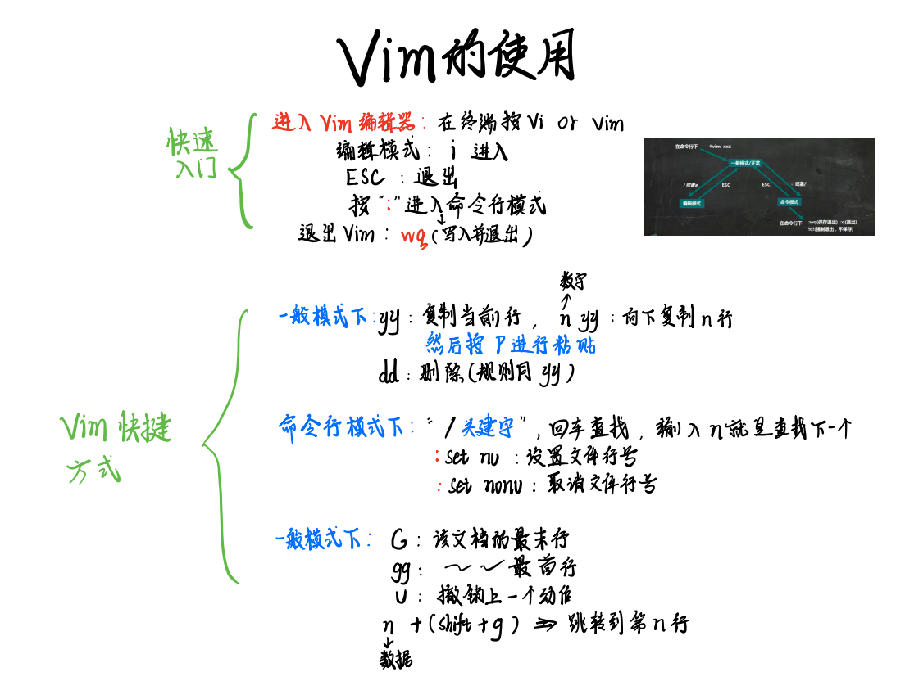

## LINUX基础与进阶


### vim的使用




> 有时候会出现 E37: No write since last change (add ! to override)
>
> 故障原因：
>
> 文件为只读文件，无法修改。
>
> 解决办法：
>
> 使用命令:w!强制存盘即可，在vim模式下，键入以下命令：
>
> :w！
>


在Vim中，你可以使用以下命令来查找某个字符的数量：

1. 按`Esc`键进入普通模式。
2. 输入`:%s/要查找的字符//gn`，然后按`Enter`键。
3. 输入`/\<0\>\s`然后按`Enter`键就可以精准找到只包含这个字符的元素。

例如，如果你想查找字符`a`的数量，你可以输入`:%s/a//gn`，然后按`Enter`键。Vim会在底部显示匹配的数量。

注意，如果要查找的字符是特殊字符（如`.`、`*`、`\`等），你需要在字符前面加上`\`进行转义。例如，如果你想查找`.`字符的数量，你应该输入`:%s/\.//gn`。


### **awk 的使用**

`awk` 是一个强大的文本处理工具，它在 Linux 和 Unix 系统中广泛使用。它用于执行各种文本操作，如提取、转换和报告数据。

`awk` 命令的基本语法如下：

```bash
awk 'pattern { action }' file
```

其中 `pattern` 是一个正则表达式，用于指定要匹配的文本模式；`action` 是一组命令，用于指定当文本与模式匹配时要执行的操作；`file` 是要处理的文件。

**搜索**

例如，要在文件 `file.txt` 中搜索字符串 `word` 并打印匹配的行，可以使用以下命令：

```bash
awk '/word/ { print }' file.txt
```

这条命令使用正则表达式 `/word/` 来匹配包含字符串 `word` 的行，并使用 `print` 命令来打印匹配的行。

**内置函数**

> - 数学函数：`sin()`、`cos()`、`atan2()`、`exp()`、`log()`、`sqrt()`、`int()` 等。
> - 字符串函数：`gsub()`、`index()`、`length()`、`match()`、`split()`、`sprintf()`、`sub()`、`substr()` 等。
> - 时间日期函数：`systime()`、`strftime()` 等。
> - 流程控制函数：`exit`、`next` 等。

你可以使用 `awk` 的许多内置函数和变量来完成更复杂的任务。例如，下面是一个计算文件中数字平均值的例子：

```bash
awk '{sum += $1; count++} END {print sum/count}' myfile.txt
```

这个命令会读取 `myfile.txt` 文件，并将每一行的第一个字段累加到变量 `sum` 中，同时将计数器 `count` 加 1。在处理完所有行后，使用 `END {print sum/count}` 代码块计算平均值并将其打印出来。

**循环**

```bash
awk 'BEGIN {for (i = 1; i <= 10; i++) print i}' 
```

这个命令使用 `BEGIN` 代码块在处理文件之前执行操作。在 `BEGIN` 代码块中，我们使用 `for` 循环语句循环打印数字 1 到 10。

你也可以在 `awk` 脚本中使用 `while` 循环语句。下面是一个使用 `while` 循环语句的例子：

```bash
awk 'BEGIN {i = 1; while (i <= 10) {print i; i++}}' 
```

这个命令与上面的类似，不管用了`while循环`

**条件**

下面是一个使用 `awk` 条件语句的例子：

```sh
awk '{if ($1 > 10) print $1}' myfile.txt
```

这个命令会读取 `myfile.txt` 文件，并检查每一行的第一个字段是否大于 10。如果满足条件，那么将该字段打印出来。

你也可以使用 `else` 语句来指定不满足条件时的操作。下面是一个例子：

```sh
awk '{if ($1 > 10) print $1; else print "Too small"}' myfile.txt
```

这个命令与上一个例子类似，只不过在不满足条件时，会打印出 “Too small”。

**个人实操**

```bash
awk -F '\t' '$5 != "."' a.vcf > b.vcf
```

这个 `awk` 命令的作用是从 `a.vcf` 文件中筛选出第 5 列不等于 `"."` 的行，并将结果保存到 `b.vcf` 文件中。

下面是对这个命令的逐步解释：

- `-F '\t'`：指定字段分隔符为制表符（`\t`）。
- `'$5 != "."'`：指定筛选条件为第 5 列不等于 `"."`。
- `a.vcf`：指定输入文件为 `a.vcf`。
- `>`：将输出重定向到文件。
- `b.vcf`：指定输出文件为 `b.vcf`。

```bash
awk 'END {print NF}' a.vcf
```

这个 `awk` 命令的作用是打印出 `a.vcf` 文件中最后一行的字段数。

下面是对这个命令的逐步解释：

- `END`：指定在处理完所有行后执行操作。
- `{print NF}`：打印出变量 `NF` 的值。`NF` 是 `awk` 的一个内置变量，表示当前行的字段数。
- `a.vcf`：指定输入文件为 `a.vcf`。


### **sed 的使用**

`sed` 是一个流编辑器，它可以在命令行中对文本文件或流进行操作。它没有交互式文本编辑器界面，而是通过提供指令来操作文本¹。

使用 `sed` 命令，你可以执行以下操作：
- 选择文本
- 替换文本
- 向文本中添加行
- 删除文本中的行
- 修改（或保留）原始文件

`sed` 命令的基础很容易学习，但要熟练掌握需要大量的练习。如果你想了解更多关于 `sed` 命令的信息，[可以查看相关文档](https://www.howtogeek.com/666395/how-to-use-the-sed-command-on-linux/.)。

example:

```bash
sed '/^##/! s\/\|\g' new2_Dam_edit.vcf > new2_Dam_edit2.vcf
```

这个命令使用 `sed` 对文件 `new2_Dam_edit.vcf` 进行处理，并将结果输出到文件 `new2_Dam_edit2.vcf` 中。

`sed` 命令中的 `/^##/!` 表示对不以 `##` 开头的行进行处理。

`s\/\|\g` 是一个替换命令，它将每一行中的所有 `/` 字符替换为 `|` 字符。

综上所述，这个命令的作用是将文件 `new2_Dam_edit.vcf` 中不以 `##` 开头的行中的所有 `/` 字符替换为 `|` 字符，并将结果输出到文件 `new2_Dam_edit2.vcf` 中。


## 运行级别


修改默认运行级别：

**multi-user.target** = runlevel 3

**graphical.target** = runlevel 5

查看当前运行级别bash命令：**systemctl get-default**

更改默认运行级别bash命令：**systemctl set-default *TARGET.*target**

## 帮助指令

**man**获取帮助信息

基本语法：**man[命令或配置文件]**，如man ls

按q退出

在linux下，隐藏文件是以 **.**开头，选项可以组合使用 比如 ls -al，ls -la /root(顺序无影响）

**help指令**

基本语法：help 命令（功能描述：获得shell内置命令的帮助信息）

## 文件目录指令

**pwd指令**

基本语法：pwd   (功能描述：显示当前工作目录的绝对路径）

（绝对路径：指的是从根目录开始显示，相对路径：指的是从当前目录开始显示）

**ls指令**

基本语法：ls   [选项] [目录或是文件]

常用选项：	-a ：显示当前目录所有的文件和目录，包括隐藏文件。

​					   -l ：以列表的方式显示信息


添加无所谓，删除需谨慎，修改需备份。

**touch指令**

touch指令创建空文件

基本语法：touch [文件名称]


**批量删除同名文件**


```bash
rm -rf *filename.*
```

**批量重命名文件**（util-linux因为这是服务器上的还有[perl上]([批量重命名文件 - Linux Wiki (linux-wiki.cn)](http://linux-wiki.cn/wiki/zh-hk/批量重命名文件))的）

```bash
rename -v age_SSGBLUP age_GBLUP *  //这个是将包含前者部分的文件批量重命名为后者部分//
rename .htm .html *.htm			//將當前目錄後綴為.htm的文件改為.html。
```


## 统计指令

**wc指令**

`wc` 是一个用于统计文本文件中行数、字数和字符数的命令。它的基本语法如下：

```bash
wc [options] [file]
```

其中，`options` 是可选的参数，用来指定统计哪些信息；`file` 是要统计的文件。

```bash
wc -l myfile.txt  #统计文件行数

wc -w myfile.txt 	#统计文件中字数

wc -l -w -c myfile.txt  #同时统计行数，字数和字符数

wc -L myfile.txt 	#打印最长的一行的长度
```


## 环境变量的修改

对单一用户,**永久有效**

首先，进入该用户目录的.bash_profile文件  

```bash
vim ~/.bash_profile  
```

在这个文件被添加需要添加的环境变量(路径为你想要用的软件所在的路径)

```bash
export PATH="$PATH:/xxx/xxx/xxx"
```

最后，键入下面命令，环境变量就生效了

```bash
source ~/.bash_profile  
```

只对当前shell有效，**临时的**：

```bash
export PATH=/usr/local/webserver/php/bin:$PATH  
```
