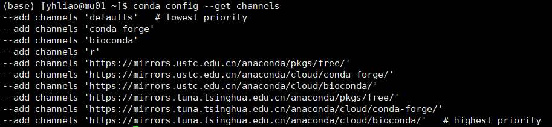
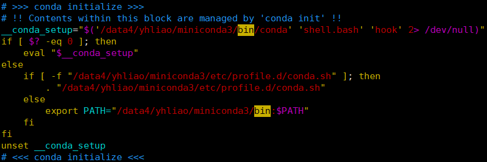
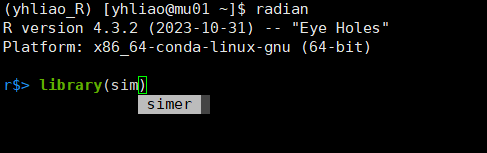

# Linux 环境下conda的安装以及使用

## 背景

Conda 是一个开源的软件包管理和环境管理系统，用于在不同操作系统上安装、运行和管理软件。它可以用于安装和管理不同语言的软件包，并创建隔离的运行环境。以下是一些 Conda 的主要特点和用途：

1. **跨平台：** Conda 可以在 Linux、Windows 和 macOS 等多个操作系统上运行，因此你可以在不同的环境中使用相同的软件包和环境配置。
2. **软件包管理：** Conda 可以轻松安装、更新、卸载和管理软件包。它支持多种语言和工具链，包括 Python、R、Julia、Ruby、Lua、Scala、Java、JavaScript 等。
3. **环境管理：** Conda 允许你创建、导出、列出、删除和更新不同的环境。这样可以在不同的项目中使用相互独立的软件包集，避免冲突和版本问题。
4. **快速安装：** Conda 使用二进制软件包，因此安装速度较快。此外，它能够解决软件包依赖关系，确保所安装的软件包与其依赖项兼容。
5. **扩展性：** Conda 不仅可以管理 Python 包，还可以用于安装和管理其他语言的软件包。它还支持自定义软件包源。
6. **数据科学和机器学习：** Conda 在数据科学和机器学习领域得到广泛使用，因为它方便地管理各种数据科学工具和库。

下面是一些常用的 Conda 命令：

- `conda create`: 创建新的环境。
- `conda activate`: 激活一个已经存在的环境。
- `conda install`: 安装软件包。
- `conda update`: 更新已安装的软件包。
- `conda remove`: 卸载软件包。
- `conda env list`: 列出所有存在的环境。
- `conda list`: 列出当前环境中安装的软件包。

要安装 Conda，你可以下载并安装 Miniconda 或 Anaconda。Miniconda 是一个轻量级的 Conda 版本，仅包含 Conda 和基本的工具，而 Anaconda 包含了更多的科学计算和数据科学工具。


## [conda的安装与卸载](https://blog.csdn.net/weixin_64316191/article/details/127435729)

### 安装

**以下用安装miniconda为例：**

1. 下载conda的安装脚本

   ```bash
   cd ~  # 推荐将 conda 安装在家目录下
   wget -c https://mirrors.tuna.tsinghua.edu.cn/anaconda/miniconda/Miniconda3-py39_4.10.3-Linux-x86_64.sh
   ```

2. 执行脚本

   ```bash
   bash Miniconda3-py39_4.10.3-Linux-x86_64.sh
   ```

   

3. 阅读并同意使用conda的相关协议，不停地回车然后输入 yes再回车就安装成功了, 执行脚本后输入的文字的顺序可以[参考这个](https://www.bilibili.com/video/BV1xe4y1U7Fe/?spm_id_from=333.337.search-card.all.click&vd_source=2390ba6464382a57d24aed101974d68d)

   ```
   回车
   q
   yes
   回车
   yes
   ```

 4. 为了让安装立即生效，需要执行 .bashrc 脚本，这样会立即进入到 conda 的 base 环境下

    ```bash
    source ~/.bashrc
    ```

    

    成功后会在前面出现（base)

 5.  添加官方源和国内源，这**几乎**是提速 conda 的唯一方式了。

    ```bash
    # 添加官方源
    conda config --add channels r # R软件包
    conda config --add channels conda-forge # Conda社区维护的不在默认通道中的软件
    conda config --add channels bioconda # 生物信息学类工具
    
    # 添加国内源头 （选其一添加即可）
    # 添加中科大源
    conda config --add channels https://mirrors.ustc.edu.cn/anaconda/pkgs/free/
    conda config --add channels https://mirrors.ustc.edu.cn/anaconda/cloud/conda-forge/
    conda config --add channels https://mirrors.ustc.edu.cn/anaconda/cloud/bioconda/
    conda config --set show_channel_urls yes
    
    # 添加清华大学源
    conda config --add channels https://mirrors.tuna.tsinghua.edu.cn/anaconda/pkgs/free/
    conda config --add channels https://mirrors.tuna.tsinghua.edu.cn/anaconda/cloud/conda-forge/
    conda config --add channels https://mirrors.tuna.tsinghua.edu.cn/anaconda/cloud/bioconda/
    conda config --set show_channel_urls yes
    
    ```

 6. 查看 conda 源是否配置成功，可以看出各 channel 的优先级（从上到下优先级依次增加）

    ```bash
    conda config --get channels
    ```

    

**安装完成！**

### 卸载

conda 的卸载很方便，因为 conda 的安装并不会污染其他系统目录，conda 几乎将所有数据都保存在 miniconda3 目录下

```bash
rm -rf .conda
rm -rf .condarc
rm -rf miniconda3
```

然后再删除 `~/.bashrc` 文件中的 conda 初始化添加的语句，也就是删除图示内容



**这一步用vim删除就行**

删完之后执行一下` .bashrc` 文件

```bash
source ~/.bashrc
```


## conda的环境配置，软件与R包安装

### conda环境配置

```bash
conda create -n yhliao_R python=3.8 #虚拟环境的创建， -n后跟虚拟环境的变量名

conda activate yhliao_R #激活虚拟环境
```


激活虚拟环境以后前面会出现目前虚拟环境的变量名, 若要返回`base`环境，则使用 `conda activate base` 就行

### conda安装软件

以R语言为例子

```bash
conda install R #默认装最新版本的R

conda install R=4.1.0 #安装指定版本的R
```

### 安装R包

安装R包有三种方式：

1. 最简单的就是直接打开R语言用 `install.packages()`函数进行安装，但是这种方式有很高的概率会报错，不建议直接使用

   

2. 第二种用conda进行安装：

   ```bash
   conda install r-packagesname #安装r包需要在包的名字上加上 `r-`
   ```

   这种方法很简易，有些个人包可能在源上找不到，比如 `simer` ， 也许更换源可能会有效果，但是我换了好几种源都没有成功安装

   **若某个源不可用导致报错，可用`conda -h`找到储存源所在的文件路径，然后用vim删除该源**

   

3.  最后一种是使用R语言内的 `devtools` 或者 `remote` 包进行安装， 下面以安装`simer`为例子：

   ```bash
   conda intstall r-devtools #先用conda安装devtools包
   
   devtools::install_github("xiaolei-lab/SIMER") #调用devtools包的函数从github上装
   ```

   这种方式比较灵活，但是在安装过程中可能会出现依赖包安装不完整的情况，就比如`simer`， **如果在安装过程中遇到某些依赖包没有安装上，或者安装不完整，强烈建议使用 conda 单独安装这个依赖包**


#### R语言启动小工具radian

最后推荐一下R语言的一个启动小工具，radian可以让服务器上苍白的R代码变得有颜色，增强代码的可读性，而且强化了服务器上的 Tab 键的补全功能。

```bash
conda install radian #安装radian

radian #用radian启动R语言
```

