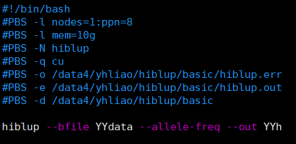
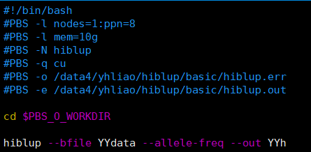
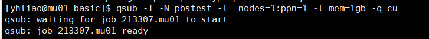
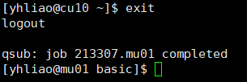

# PBS

**PBS** **（Portable Batch System*）**, 最初由NASA的Ames研究中心开发，设计为一个能满足异构计算网络需要的软件包。它力求提供对批处理的初始化和调度执行的控制，允许作业在不同主机间的路由

### 作业控制

**qsub：提交作业**

**qdel：取消作业**

qsig：给作业发送信号

qhold：挂起作业

qrls：释放挂起的作业

qrerun：重新运行作业

qmove：将作业移动到另一个队列

qalter： 更改作业资源属性，与队列

### 作业监测

**qstat：显示作业状态**

**showq： 查看所有作业**

### 节点状态

**pbsnodes：列出集群中所有节点的状态和属性**

pestat：各节点使用情况

### 提交作业：   qsub

使用PBS提交作业有两种形式：① 通过命令行传递参数给作业

​												  ② 编写PBS作业脚本，以#PBS的形式指定参数

**常用的PBS作业属性**

| 属性 | 取值                   | 说明                           |
| ---- | ---------------------- | ------------------------------ |
| -l   | 以逗号分隔的资源列表   | 设定作业所需资源               |
| -N   | 作业名称               | 设定作业名称                   |
| -o   | 文件路径               | 设定作业的标准输出文件路径     |
| -e   | 文件路径               | 设定作业的标准错误文件路径     |
| -p   | -1024到+1023之间的整数 | 设定作业优先级，越大优先级越高 |
| -q   | 队列名称               | 设定作业队列名称               |

| 资源     | 取值                       | 说明                           |
| -------- | -------------------------- | ------------------------------ |
| nodes    | 节点资源构型               | 设定作业所需计算节点资源       |
| walltime | hh:mm:ss                   | 设定作业所需的最大walllock时间 |
| cput     | hh:mm:ss                   | 设定作业所需的最大CPU时间      |
| mem      | 正整数，后面可跟b,kb,mb,gb | 设定作业所需的最大内存         |
| ncpus    | 正整数                     | 设定作业所需的CPU数目          |

下面我们来看一个简单的PBS脚本例子



第一行  **#！/bin/bash**  是在定义使用什么指令来执行下面的命令

第二行开始带 **#PBS - **的都是在给PBS指定参数

如 **#PBS -l nodes=1:ppn=8** 就是申请1个节点（nodes),每个节点 8 个处理器

剩下的自己对照上面看吧。

但是我这个脚本没有生成标准输出和标准错误文件， 需要多加学习以了解是什么原因, ~~也许是我太强了根本没有错误~~

最后因为PBS的默认执行路径是我们的 **home** 路径，如果不想登录就看到一堆乱东东的东西的话，记得设置

**#PBS -d /data4/yhliao/鬼知道你在哪里执行**  这个参数可以让我们在指定的路径里执行下面的指令，或者！你可以试点很酷的东西! 环境变量！

e.g:

效果和#PBS -d /..../... 是一样的，用起来还更方便。其他的环境变量自己看看下面吧~

ok，上面那些蓝不拉及的东西就是参数指令了，还有很多啊，这只是一个简单的。具体的看看上面。每次设置的时候注意 **申请的节点和处理器数量**，**排队路径**， **工作路径** 

下面就是你要提交运行的命令了，这里用一个简单的hiblup操作来举例。

**注意，可能当你调用不是本用户安装的软件（比如集群里的R）的时候PBS脚本不会与你共享环境变量，这时候记得在命令前面加上相应的绝对路径**

当然你喜欢的话也可以用命令行来传递参数给作业啊：

```bash
qsub -N 君の名前 -l nodes=1:ppn=2 -l mem=lgb -q cu haha.sh
```

这里的haha.sh就是你要提交的命令，如果是bash指令操作的，注意加上什么？

对的 **#！/bin/bash**


看了以上这些，你不觉得每次都得申请这些很烦吗？

那就试试 **交互模式** 吧！

```bash
qsub -I -N 君の名前 -l nodes=1:ppn=1 -l mem=1gb -q cu
```

成功进入以后会：~~boom!~~



是不是很像直接ssh 进入cu 节点，但是却有本质的不同： ~~这个不会挨师姐拷打~~， 这个定义了自己要用的资源，这样大伙就能让服务器效率最高了。

但是别爽完就忘了，工作结束以后记得键入 **exit** 来结束自己的作业啊

如下：


剩下还有一些很高级的东西啊，但是我现在基本没有参透，这些环境变量不知道干啥的。~~希望毕业前可以删掉这句话，先删半句开心一下~~

| 变量名                | 说明                                                         |
| --------------------- | ------------------------------------------------------------ |
| 登录SHELL继承来的变量 | 包括$HOME, $LANG, $LOGNAME, $PATH, $MAIL, $SHELL 和 $TZ      |
| $PBS_O_HOST           | qsub提交的节点名称                                           |
| $PBS_O_QUEUE          | qsub提交的作业的最初队列名称                                 |
| **$PBS_O_WORKDIR**    | qsub提交的作业的绝对路径                                     |
| **$PBS_O_JOBID**      | 作业被PBS系统指定的作业号                                    |
| **$PBS_JOBNAME**      | 用户指定的作业名，可以在作业提交的时候使用qsub -N<作业名> 指定，或者在PBS脚本中加入#PBS -N <作业名> |
| **$PBS_NODEFILE**     | PBS系统指定的作业运行的节点名，该变量在并行机和机群中使用，当在PBS脚本中使用#PBS -l nodes=2:ppn=2指定程序运行的节点数时，可以使用$PBS_NODEFILE在脚本中引用PBS系统指定的作业运行节点名，比如: #PBS -l nodes=2:ppn2                                                    mpirun -np4 -machinefile $PBS_NODEFILE<程序名> |
| $PBS_QUEUE            | PBS脚本在执行时的队列名                                      |

好，学完了如何提交任务以后，还得对自己提交上去的作业进行控制是吧，那么我们来汇总一下：

| 命令  | 功能     | 使用说明           | 示例           |
| ----- | -------- | ------------------ | -------------- |
| qsub  | 提交作业 | qsub   [script]    | $ qsub job.pbs |
| qdel  | 删除作业 | qdel    [job_id]   | $ qdel 12345   |
| qhold | 挂起作业 | qhold   [job_id]   | $ qhold 12345  |
| qrls  | 释放作业 | qrls      [job_id] | $ qrls 12345   |

**作业状态查询命令**

| qstat -q         | 列出所有队列            |
| ---------------- | ----------------------- |
| qstat -a         | 列出所有作业            |
| qstat -u user_id | 列出user_id的所有作业   |
| qstat -r         | 列出所有正在运行的作业  |
| qstat -f job_id  | 列出作业job_id的信息    |
| qstat -fQ queue  | 列出所有队列的queue信息 |
| qstat -B         | 列出所有作业状态的汇总  |
| pbsnodes         | 列出所有节点的详细信息  |
| pestat           | 列出所有节点的状态      |


PBS还可以批量提交作业，**qsub -v** 但是我还没有参透，而且目前还用不上。[有需求的时候再看看这个吧](https://mp.weixin.qq.com/s/gO--Yv9ZakXGaCCqMksUVA)


### 作业依赖关系

[在PBS（Portable Batch System）中，您可以使用作业依赖关系来控制作业的执行顺序。您可以使用`-W`选项来设置作业依赖关系，其语法为：`-W depend=:`](https://bluewaters.ncsa.illinois.edu/job-dependencies)[1](https://bluewaters.ncsa.illinois.edu/job-dependencies)。

例如，如果您想让一个作业在另一个作业完成后才开始执行，您可以使用`afterok`依赖类型。假设您已经提交了一个作业，其JobID为12345，您现在想提交一个新的作业，并且希望它在JobID为12345的作业完成后才开始执行。那么您可以使用以下命令来提交新的作业：`qsub -W depend=afterok:12345 your_job_script.sh`。

除了`afterok`之外，PBS还支持其他类型的作业依赖关系，包括`after`, `afternotok`, `afterany`, `before`, `beforeok`, `beforenotok`, `beforeany`等。每种依赖类型都有不同的含义和用途。


## 脚本示例

这是一个循环使用conform-gt进行进行beagle的参考文件与目标文件校正的脚本。

```bash
#!/bin/bash
#PBS -N conform-gt
#PBS -l nodes=2:ppn=10
#PBS -l mem=64gb
#PBS -q cu
#PBS -j oe

# 进入工作目录
cd $PBS_O_WORKDIR

# 指定参考和目标 VCF 文件的路径, 注意conform-gt不能使用bref3文件
REF_VCF=/data4/yhliao/beagle/YX_58097.vcf.gz.vcf.gz
TARGET_VCF=/data4/yhliao/beagle/Dam.vcf

# 指定 conform-gt 程序的路径
CONFORM_GT=/data4/yhliao/beagle/conform-gt.24May16.cee.jar

# 指定输出文件的前缀
OUT_PREFIX=/data4/yhliao/beagle/Dam18_edited

# 循环遍历所有染色体
for CHR in {1..18} 23
do
    # 运行 conform-gt 命令
    java -jar $CONFORM_GT \
        ref=$REF_VCF \
        gt=$TARGET_VCF \
        chrom=$CHR \
        out=$OUT_PREFIX.chr$CHR
done

# 合并所有染色体的结果（可选），这里的vcf-concat是vcftools的功能
vcf-concat $OUT_PREFIX.chr*.vcf.gz | bgzip -c > $OUT_PREFIX.vcf.gz

```

