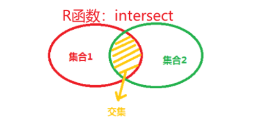
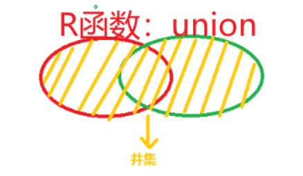
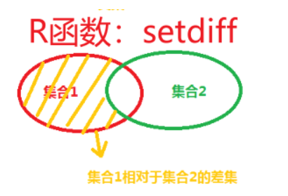

# R语言之多吃瘪少犯错

## 一、基础中的基础

### 1.R包的管理

#### 1.1加载包的方式与区别

一般加载包有三个函数：`library()`, `require()`, `requireNamespace()`

> [require()函数和library()函数很相似，都可以用来加载包，但有一些区别](https://blog.csdn.net/dingxie3281/article/details/102088351)
>
> - require()函数在包不存在时会返回FALSE，而library()函数会报错并停止程序。
>
> - require()函数在包已经加载时不会重复加载，而library()函数会重新加载。
>
> - require()函数可以用在其他函数里面，而library()函数只能用在全局环境中。
>
>   同样的，
>
>   [requireNamespace()函数和require()函数很相似，都可以用来加载包，但有一些区别](https://cloud.tencent.com/developer/article/1655382)
>
>   - requireNamespace()函数不会把包添加到搜索列表中，而require()函数会。也就是说用requireNamespace()加载包以后不能直接用包里的函数，还得package::package_funtion()
>   - requireNamespace()函数可以用在其他包里面，而require()函数不建议用在其他包里面。
>   - requireNamespace()函数可以用来加载特定版本的包，而require()函数不能。

#### 1.2更新R包

在RStudio中用“Tools–Check for Package Updates”菜单， 可以显示有新版本的扩展包， 并选择进行更新。

或者在命令行用如下命令更新本地安装的所有有新版本的CRAN扩展包：

```R
options(repos=c(CRAN="http://mirror.tuna.tsinghua.edu.cn/CRAN/"))
update.packages(checkBuilt=TRUE, ask=FALSE)
```

#### 1.3迁移R包

在每一次R软件更新后， 需要重新安装原来的软件包， 这个过程很麻烦。 如果仅仅是小的版本更新可以在安装新版本后， 临时将新版本的library子目录更名为library0， 将老版本的library子目录剪切为新版本的library子目录， 然后将library0中所有内容复制并覆盖进入library子目录， 删除library0即可。 然后在基本R中（不要用RStudio）运行如下命令以更新有新版本的包：

```R
options(repos=c(CRAN="http://mirror.tuna.tsinghua.edu.cn/CRAN/"))
update.packages(checkBuilt=TRUE, ask=FALSE)


```

如果版本改变比较大， 可以用如下方法批量地重新安装原有的软件包。 首先，在更新R软件前，在原来的R中运行：

```R
packages <- .packages(TRUE)
dump("packages", file="packages-20180704.R")
```

这样可以获得要安装的软件包的列表。 在更新R软件后， 运行如下程序：

```R
options(repos=c(CRAN="http://mirror.tuna.tsinghua.edu.cn/CRAN/"))
source("packages-20180704.R")
install.packages(packages)
```

### 2.输出

#### 2.1简单输出

当使用`source()`函数执行一个源代码文件的时候，想要输出某一个表达式的结果的话，可以使用`print() `来进行输出，`cat()` 函数用于将多个对象连接起来并打印出来。下面是一个简单的例子：

```r
x <- 1:3
y <- c("a", "b", "c")
cat("The vectors are:", x, "and", y, "\n")
```

运行上面的代码，你会在控制台中看到以下输出：

```R
The vectors are: 1 2 3 and a b c 
```

#### 2.1.2用`sink（）`函数作运行记录

在R命令行中运行过的命令会被保存在运行的工作文件夹中的一个名为.Rhistory的文件中。 用`sink()`函数打开一个文本文件开始记录文本型输出结果。 结束记录时用空的`sink()`即可关闭文件不再记录。 如

```R
sink("tmpres01.txt", split=TRUE) #表示将输出重定向到名为 “tmpres01.txt” 的文件中，并且使用 split=TRUE 参数来同时在控制台和文件中显示输出。
print(sin(pi/6))
print(cos(pi/6))
cat("t(10)的双侧0.05分位数（临界值）=", qt(1 - 0.05/2, 10), "\n")
sink()
```

`sink()`用作输出记录主要是在测试运行中使用， 正常的输出应该使用`cat()`函数、`write.table()`、`write.csv()`等函数。


#### 2.2运行源程序文件

使用`source（）`函数可以调用`.r`的脚本文件里源程序，比如`source（xx.r）`便可以调用xx.r文件里的自定函数了。

`source（）`函数种可以添加`encoding=`选项，可以更改源程序的编码方式。


## 1.数据筛选编辑

### [交集、并集、补集，差集的实现](HTTP://blog.csdn.net/yijiaobani/article/details/124944900?utm_medium=distribute.pc_relevant.none-task-blog-2~default~baidujs_baidulandingword~default-0-124944900-blog-80494605.pc_relevant_multi_platform_whitelistv4&spm=1001.2101.3001.4242.1&utm_relevant_index=3)

r包：dplyr

**交集**




```R
intersect(a,b)
```

**并集**




```R
union(a,b)
```

**补集**




```R
setdiff(a,b)	#取a有但是b没有的
setdiff(b,a)	#取b有但是a没有的
```

[数据框操作](https://www.jianshu.com/p/1f4c7bfed3d4)

**交集**

```R
inner_join(d1,d2,by="ID") #by = "name"指的是根据数据框的哪里来合并

```

**并集**

```R
full_join(d1,d2,by="ID")

```

**合并**

```R
left_join(d1,d2,by="ID")	#以d1为准

right_join(d1,d2,by="ID")	#以d2为准

```

**剔除**

```R
anti_join(d1,d2,by="ID")	#在d1中去除d2的ID

semi_join(d1,d2,by="ID")	#在d1中提取d2的ID

```

## 杂七杂八操作

#### 数据操作类

**在数据框的指定位置插入特定的列**

```R
#使用示例数据mtcars
data(mtcars)
#创建一列特定的列
col <- mtcars[,2]
#目标数据框
df <- mtcars[,3:8]

##将特定列插入df的指定位置##
df_down <- cbind(df[,1], col, df[,2:ncol(df)])	#插入df的第二列，有可能会打乱某个元素的行位置
df_down <- cbind(df[,1:3], col, df[3:ncol(df)])	#插入df的第三列
```

**查找列里的重复元素**

```R
##假设有一个数据框dt1其行、列间都有重复数据##
#行内有重复数据
unique(dt1)

#列内有重复数据
duplicated(dt1)
dt1[duplicated(dt1),]
which(duplicated(dt1))
##分别输出每一行数据和前面是否是重复的，重复数据，重复数据所在的行

```

**对比向量及其元素**

`identical()` 函数用于比较两个对象，如果它们相等则返回 TRUE。`setequal()` 函数用于比较两个集合，如果它们具有相同的元素，则无论其顺序如何都返回 TRUE。`all.equal()` 函数用于比较两个对象，如果它们不相等，则返回描述它们之间差异的字符字符串。例如，如果您有两个向量 `x` 和 `y`，您可以使用以下代码使用这些函数进行比较：

```R
identical(x, y) # 如果 x 和 y 相等则返回 TRUE
setequal(x, y) # 如果 x 和 y 具有相同的元素，则无论其顺序如何都返回 TRUE
all.equal(x, y) # 如果 x 和 y 不相等，则返回描述它们之间差异的字符字符串
```


#### 不知道怎么分类

```R
edit(packagesName::funtionName) #可以查看某个函数的源码
```

如果您在读取数据后发现数字被转换为了科学计数法，这可能是因为R在显示数据时默认使用了科学计数法。您可以使用`options()`函数来更改R的默认显示方式，例如：

```R
options(scipen = 999)
```

这会将`scipen`选项设置为一个较大的值，从而避免R在显示数据时使用科学计数法。您可以在读取数据之前运行这个命令，以便在查看数据时看到普通数字格式。


**自定义一个函数判断是否字符里面含有汉字**

```R
hv_chinese_string <- function(string) {
  if(str_detect(string,"[\\p{Han}]")){ #正则表达式判断有无汉字
    return(TRUE)
  }
  else{
    return(FALSE)
  }
}
```


**检查循环中的错误和警告**发生在哪一步主要用`tryCatch()`函数

```R
for (i in 1:length(filtered_counts_id)) {
  tryCatch({
    fit <- rlm(weight ~ age + I(age^2), data = filtered_counts_id[[i]], method = "MM", psi = psi.bisquare)
  },
  warning = function(w) {
    print(paste0("警告出现在第", i, "步"))
  })
}
```


**截取字符串的任意内容**

```r
install.packages("stringr")
library(stringr)
# 定义正则表达式
pattern <- "_(\\w+)_"   ##(\\w+)是捕获组（其中w表示任意字符，若用d则是数字），这个正则表达式捕获所有以`_`开头结尾的内容
# 使用正则表达式截取数字1
outlier_numbers <- str_extract(outlier_id, pattern) ##但str_extract函数返回整个字符串，包括头尾的_
outlier_numbers <- substr(outlier_numbers,2, nchar(outlier_numbers) - 1)
#outlier_numbers <- str_remove_all(outlier_numbers, "_") 更好的方案
 
```

