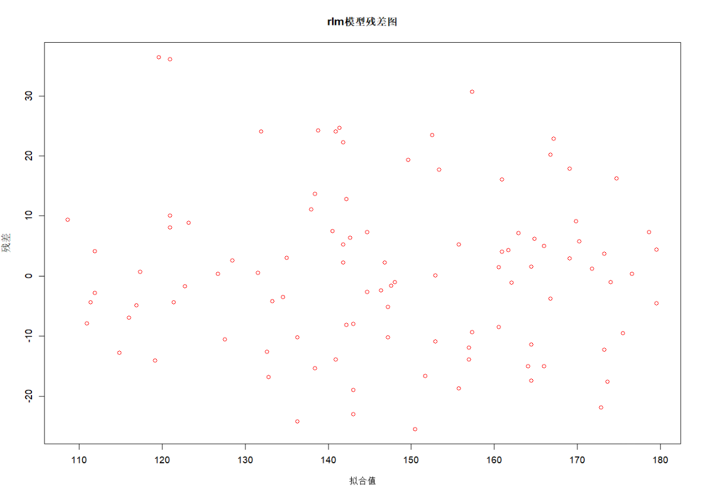

# 绘图记录

## 简介

​	这个`.md`文件主要用于记录各式各样的图表绘制方法，重点以R语言的`ggplot2`包为例子。

## 箱线图（Box plot）

**箱线图**：箱线图是一种常用的数据可视化方法，它能够展示数据的分布情况。一个箱线图通常包括以下几个部分：

> - 箱体：箱体表示数据的四分位距，即上四分位数（Q3）和下四分位数（Q1）之间的范围。箱体的上边缘表示上四分位数，下边缘表示下四分位数。
> - 中位线：箱体内部的一条线，表示数据的中位数（Q2）。
> - 触须：从箱体上下两端延伸出去的两条线段，表示数据的最大值和最小值。触须的长度通常被限制在1.5倍的四分位距以内。
> - 异常值：在触须之外的点，表示数据中的异常值。
>

通过观察箱线图，我们可以快速地了解数据的分布情况。例如，我们可以看出数据的中位数、四分位距、极值和异常值等信息。此外，我们还可以通过比较不同类别之间的箱线图来了解它们之间的差异。

```R
library(tidyverse)
library(ggplot2)
#做出一个储存预对比数据的数据框
box_age100 <- data.frame(temp_pure[,c(12,22)]) 

# 将数据框转换为长格式
box_age100_long <- pivot_longer(box_age100, cols = c(校正100公斤体重日龄, AGE100kg), names_to = "variable", values_to = "value")

# 创建一个基础图层
p <- ggplot(box_age100_long, aes(x = variable, y = value, fill = variable))

# 添加箱线图图层并自定义外观
p + geom_boxplot() +
  theme_bw() + # 更改图形主题
  labs(title = "100公斤日龄箱线图", x = "变量", y = "值") + # 添加标题和坐标轴标签
  scale_fill_manual(values = c("#E64B35B2", "#4DBBD5B2")) # 更改颜色方案
 # + theme(legend.position = "none") 如果不想画出标签就加这里

```

首先，我们需要加载`tidyverse`和`ggplot2`包。`tidyverse`包是一个包含多个数据处理和可视化包的集合，其中包括`ggplot2`包。

接着，我们创建一个数据框来储存预对比的数据。这里我们使用`data.frame()`函数来创建一个新的数据框，它包含`temp_pure`数据框中第12列和第22列的数据。

然后，我们使用`pivot_longer()`函数来将数据框转换为长格式。这个函数的第一个参数是要转换的数据框，`cols`参数指定要转换的列，`names_to`参数指定新列的名称，`values_to`参数指定值列的名称。转换后的数据框将包含两列：一列是变量名称，另一列是对应的值。

接下来，我们使用`ggplot()`函数来创建一个基础图层。这个函数的第一个参数是要绘制的数据框，`aes()`函数用于指定x轴和y轴的变量，并且指定了填充颜色对应的变量。

最后，我们使用`geom_boxplot()`函数来添加箱线图图层，并使用一些其他函数来自定义箱线图的外观。例如，我们使用`theme_bw()`函数来更改图形主题，使用`labs()`函数来添加标题和坐标轴标签，使用`scale_fill_manual()`函数来更改颜色方案。

**最终成品**


但这个图有许多异常值，**我现在还不知道怎么处理这些异常值，是删还是保留？**假设我删掉这些异常值，那么接下来的操作应该是

```R
# 计算校正100公斤体重日龄列的异常值范围
outlier_range1 <- boxplot.stats(box_age100$校正100公斤体重日龄)$out

# 计算AGE100kg列的异常值范围
outlier_range2 <- boxplot.stats(box_age100$AGE100kg)$out

# 筛选出不包含异常值的数据
box_age100_no_outliers <- subset(box_age100, !(校正100公斤体重日龄 %in% outlier_range1 | AGE100kg %in% outlier_range2))

# 将数据框转换为长格式
box_age100_long_no_outliers <- pivot_longer(box_age100_no_outliers, cols = c(校正100公斤体重日龄, AGE100kg), names_to = "variable", values_to = "value")
# 创建一个基础图层
p <- ggplot(box_age100_long_no_outliers, aes(x = variable, y = value, fill = variable))

# 添加箱线图图层并自定义外观
p + geom_boxplot() +
  theme_bw() + # 更改图形主题
  labs(title = "100公斤日龄箱线图", x = "变量", y = "值") + # 添加标题和坐标轴标签
  scale_fill_manual(values = c("#E75B35B2", "#4DBBD5B2")) # 更改颜色方案
# + theme(legend.position = "none")
```

首先，我们使用`boxplot.stats()`函数来计算两列数据的异常值范围。这个函数会返回一个包含多个元素的列表，其中`out`元素包含了所有的异常值。

接着，我们使用`subset()`函数来筛选出不包含异常值的数据。这个函数的第一个参数是要筛选的数据框，第二个参数是筛选条件。在这里，我们使用`%in%`运算符和逻辑运算符`|`来指定筛选条件：只保留那些两列数据都不包含异常值的行。

> 在箱线图中，异常值通常被定义为小于下四分位数减去1.5倍四分位距或大于上四分位数加上1.5倍四分位距的值。四分位距是上四分位数和下四分位数之差。
>
> 例如，假设一组数据的下四分位数为Q1，上四分位数为Q3，那么这组数据的异常值范围就是小于Q1 - 1.5 * (Q3 - Q1)或大于Q3 + 1.5 * (Q3 - Q1)的值。
>
> `boxplot.stats()`函数会根据这个定义来计算数据的异常值范围。它会返回一个包含多个元素的列表，其中`out`元素包含了所有的异常值。

**最后结果**：


## 残差图（Residual plots）

**残差图**：是指以残差为纵坐标，以自变量或拟合值为横坐标的散点图。残差是指模型预测值与实际值的差异。

残差图可以用来检查模型的拟合效果，判断模型是否符合假设。

**常见的残差图形状**

> - **随机分布**：残差随机分布在零附近，没有明显的趋势。
> - **正态分布**：残差呈正态分布，具有零均值和单位方差。
> - **非正态分布**：残差不呈正态分布，可能存在偏斜或峰度。
> - **趋势**：残差存在趋势，例如线性趋势或非线性趋势。
> - **异常值**：残差存在异常值，可能由数据错误或模型缺陷引起。

**残差图可以用于以下场景：**

> - 检查模型的拟合效果。
> - 判断模型是否符合假设。
> - 识别数据错误或模型缺陷。
> - 改进模型的拟合效果。

**如何看残差图？**

如果你看到残差之间存在某种趋势，让你可以用一个错误来预测另一个错误，那么就说明你的模型还有提升的空间。

**如何确定残差是随机的呢？**

我们只用检查残差是否在整个拟合值范围内随机分散在零附近。它们表明模型的预测平均而言是正确的，而不是系统地过高或过低，回归还假设残差服从正态分布，并且所有拟合值的散射程度相同。


**正常的残差图里的残差分布：**


**残差间存在某种趋势的异常残差图：**


> 导致这种趋势的原因可能为：
>
> * 自变量解释不足
> * 用于对曲线建模的多项式项
> * 交互项
>
> 其他潜在原因：
>
> * 别的变量必须与残差不相关
> * 相邻的残差必须不相关
> * 残差应该有一个常量方差（没有异方差性）


**参考代码**

```R
###residual plots###
test <- sample_n(merged_counts_id, 100)

fit1 <- rlm(age ~ weight + I(weight^2), data = test, method = "MM", psi = psi.bisquare)
fit2 <- rlm(age ~ weight, data = test, method = "MM", psi = psi.bisquare)


plot(fit1$fitted.values, fit1$residuals, col = "red", type = "p",
     main = "rlm模型残差图",
     xlab = "拟合值",
     ylab = "残差")
```


